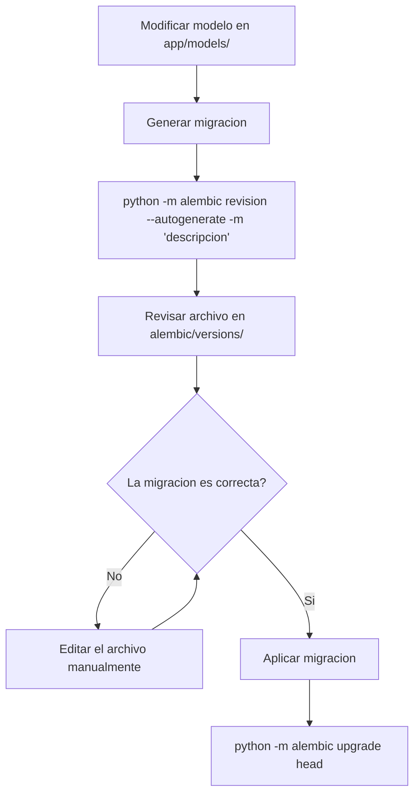

# Feature: Migraciones de Base de Datos con Alembic

## Descripcion

El proyecto adopta Alembic como herramienta de migraciones de base de datos. Sustituye el uso de `SQLModel.metadata.create_all()` en el arranque de la aplicacion para la gestion de cambios de esquema.

## Motivacion

`create_all()` solo crea tablas que no existen; nunca altera tablas ya creadas. Esto significa que cualquier cambio en un modelo existente (nueva columna, cambio de tipo, nuevo indice) requeria intervencion manual en la base de datos. Alembic genera y aplica migraciones incrementales de forma controlada y reproducible.

## Estructura de Archivos

```
hipica-backend/
├── alembic/
│   ├── env.py              # Configuracion del entorno de migraciones
│   └── versions/           # Archivos de migracion generados
│       └── <hash>_initial_schema.py   # Baseline inicial (vacio)
└── alembic.ini             # Configuracion base de Alembic
```

### `alembic/env.py`

Puntos clave de la configuracion:

- Importa `app.models` (modulo `__init__`) para que SQLModel registre todos los modelos en `metadata` antes de que Alembic los inspeccione.
- Lee la URL de conexion desde `app.core.config.DATABASE_URL`, sobreescribiendo el valor de `alembic.ini`. Esto garantiza que siempre se usa la misma URL que el resto de la aplicacion.
- Activa `compare_type=True` para detectar cambios de tipo de columna en migraciones autogeneradas.

## Baseline Inicial

La primera migracion (`initial_schema`) es intencionalmente vacia. Representa el estado de la base de datos en el momento de adoptar Alembic (tablas ya existentes). Se marca como cabeza del historial con:

```bash
python -m alembic stamp head
```

Esto indica a Alembic que la BD ya esta en ese estado sin ejecutar ninguna sentencia SQL.

## Flujo para Cambios Futuros



### Comandos habituales

| Comando | Descripcion |
|---------|-------------|
| `python -m alembic revision --autogenerate -m "descripcion"` | Generar migracion comparando modelos con BD |
| `python -m alembic upgrade head` | Aplicar todas las migraciones pendientes |
| `python -m alembic downgrade -1` | Revertir la ultima migracion |
| `python -m alembic current` | Ver version actual de la BD |
| `python -m alembic history` | Ver historial de migraciones |

### Dentro del contenedor Docker

```bash
docker-compose exec api python -m alembic upgrade head
```

## Consideraciones

- Alembic autogenera migraciones comparando el esquema de la BD actual con los metadatos de SQLModel. Siempre revisar el archivo generado antes de aplicarlo: la autogeneracion puede omitir cambios como renombrado de columnas o restricciones complejas.
- La URL de BD **no** se configura en `alembic.ini` sino que se lee de `app.core.config.DATABASE_URL`. El valor en `alembic.ini` es un placeholder que se sobreescribe en tiempo de ejecucion.
- En entornos de CI/CD, ejecutar `alembic upgrade head` al inicio del contenedor garantiza que la BD siempre esta al dia antes de arrancar la API.
