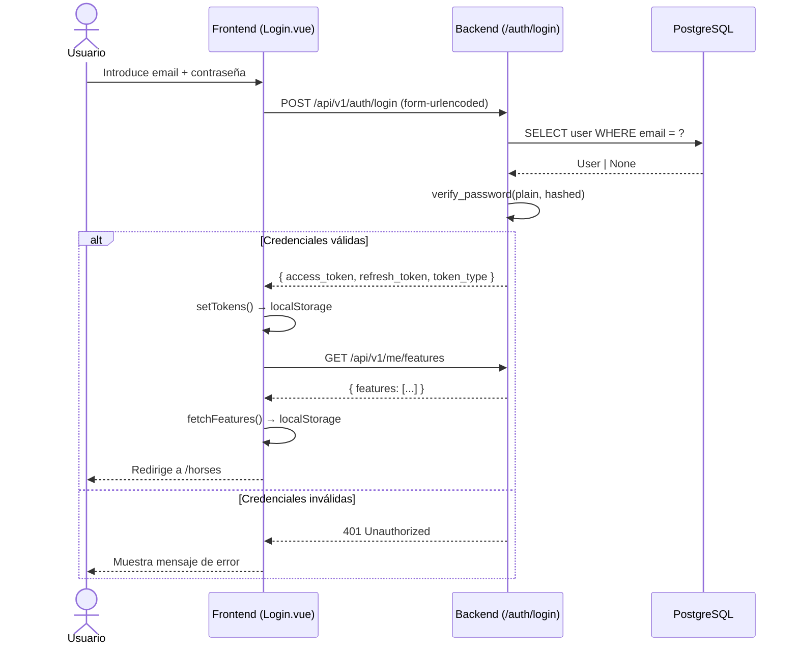
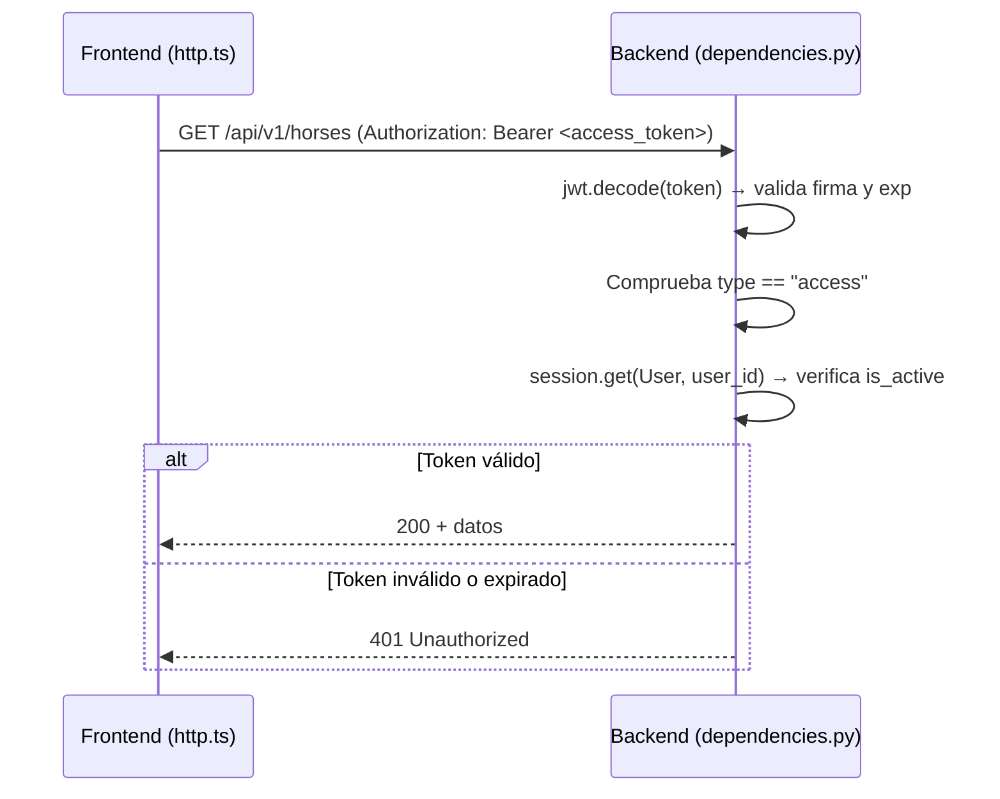
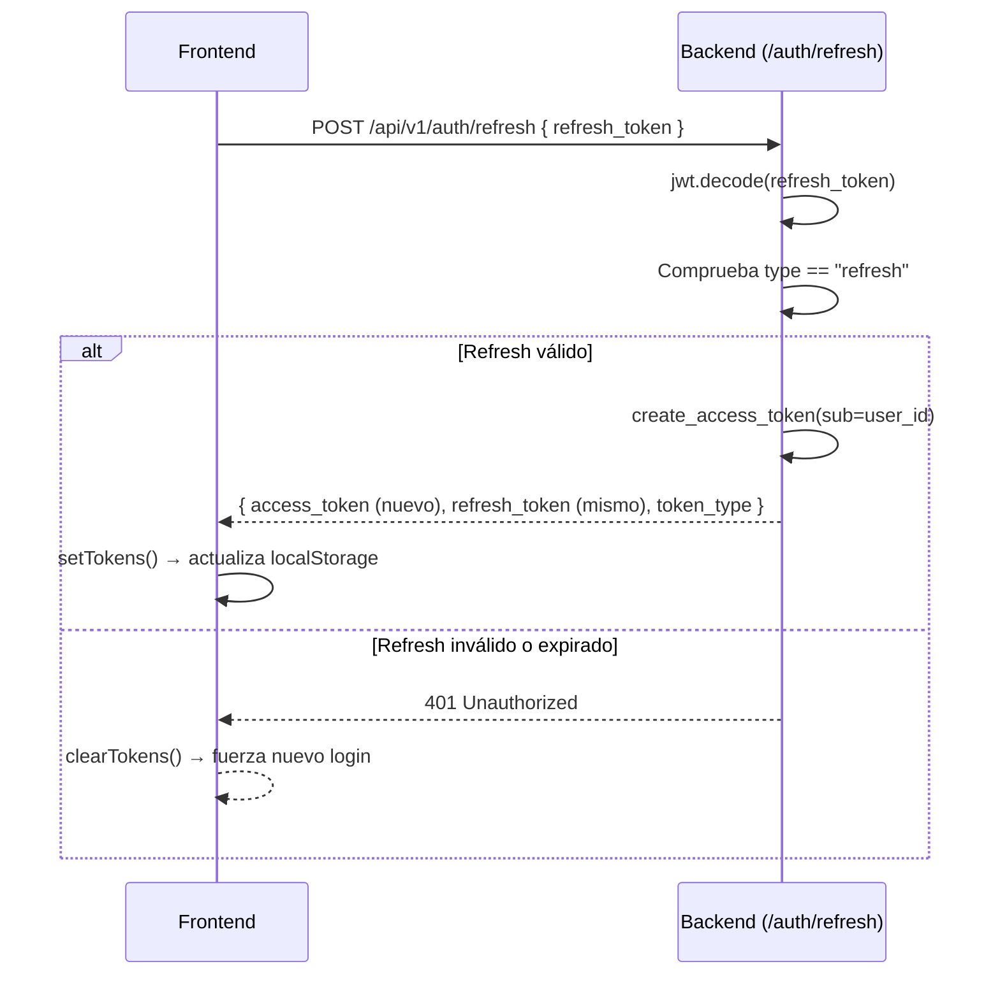

# Feature: Autenticación JWT

## Descripción

El sistema de autenticación de Hipica se basa en JWT (JSON Web Tokens) con un esquema de doble token: un **access token** de vida corta para autenticar las peticiones protegidas, y un **refresh token** de vida larga para renovar la sesión sin que el usuario tenga que volver a introducir sus credenciales.

La motivación del diseño es equilibrar seguridad (tokens de acceso con expiración corta) y experiencia de usuario (no forzar un nuevo login cada 15 minutos).

---

## Flujo de Autenticación

### Login inicial



### Petición autenticada

Cada petición posterior al login incluye el access token en la cabecera `Authorization: Bearer <token>`. El interceptor de Axios en `http.ts` inyecta este token automáticamente en todas las llamadas.



### Renovación de sesión (refresh)

Cuando el access token expira, el frontend puede solicitar uno nuevo presentando el refresh token, sin interrumpir la sesión del usuario.



---

## Endpoints involucrados

| Método | Ruta | Descripción | Autenticación requerida |
|--------|------|-------------|------------------------|
| `POST` | `/api/v1/auth/login` | Login con email y contraseña | No |
| `POST` | `/api/v1/auth/refresh` | Renovar access token con refresh token | No (lleva el refresh token en el body) |

El endpoint de login acepta formato `application/x-www-form-urlencoded` (OAuth2 estándar), usando el campo `username` para el email.

---

## Componentes involucrados

### Backend

| Archivo | Responsabilidad |
|---------|----------------|
| `app/api/v1/endpoints/auth.py` | Endpoints `POST /login` y `POST /refresh` |
| `app/security.py` | Generación y verificación de tokens JWT; hashing de contraseñas con bcrypt |
| `app/dependencies.py` | `get_current_user` (extrae y valida el JWT), `require_role` (control de acceso por rol) |
| `app/schemas/auth.py` | `TokenResponse` y `RefreshRequest` (contratos Pydantic de entrada/salida) |

### Frontend

| Archivo | Responsabilidad |
|---------|----------------|
| `src/views/Login.vue` | Formulario de login; llama al endpoint y guarda tokens |
| `src/auth/tokens.ts` | Abstracción sobre `localStorage`: `setTokens`, `getAccessToken`, `getRefreshToken`, `clearTokens`, `isLoggedIn` |
| `src/api/http.ts` | Interceptor de Axios que inyecta `Authorization: Bearer` en cada petición |
| `src/router/index.ts` | Navigation guard que redirige a `/login` si no hay token activo |

---

## Control de Acceso por Roles

La dependencia `require_role` en `app/dependencies.py` actúa como una capa de autorización por encima de `get_current_user`. Se usa directamente en la firma de los endpoints:

```python
current_user: User = Depends(require_role(["stable_admin", "app_admin"]))
```

Roles disponibles en el sistema:

| Rol | Descripción |
|-----|-------------|
| `app_admin` | Administrador global; no pertenece a ninguna hípica concreta |
| `stable_admin` | Administrador de una hípica específica |
| `monitor` | Instructor con acceso limitado a sus propias clases |
| `client` | Alumno con acceso mínimo |

Un usuario `app_admin` sin `stable_id` tiene acceso global implícito (ver también el comportamiento en `/me/features`).

---

## Decisiones Técnicas

| Decisión | Justificación |
|----------|--------------|
| Access token con 15 minutos de expiración | Minimiza la ventana de exposición si un token es comprometido |
| Refresh token con 7 días de expiración | Permite sesiones persistentes sin comprometer la seguridad a largo plazo |
| Algoritmo HS256 | Simplicidad operativa; clave simétrica gestionada en `.env` |
| Campo `type` en el payload JWT | Distingue explícitamente entre access y refresh tokens; evita que un refresh token sea usado como access token y viceversa |
| `application/x-www-form-urlencoded` en login | Compatibilidad con el estándar OAuth2 y con el cliente Swagger UI automático de FastAPI |
| Tokens en `localStorage` | Decisión pragmática para la fase actual; una migración a cookies `HttpOnly` mejoraría la protección frente a XSS |
| `is_active` comprobado en cada petición | Permite desactivar un usuario sin esperar a que expire su token |

---

## Consideraciones de Seguridad

- El `SECRET_KEY` se carga desde variables de entorno (`.env`) y nunca debe estar en el repositorio.
- El campo `type` del payload previene la reutilización cruzada de tokens.
- Si el refresh token expira, no hay renovación automática: el usuario debe hacer login de nuevo.
- El endpoint `/refresh` no verifica en base de datos; la revocación de tokens no está implementada en esta versión (se requeriría una lista negra o tokens con estado).
