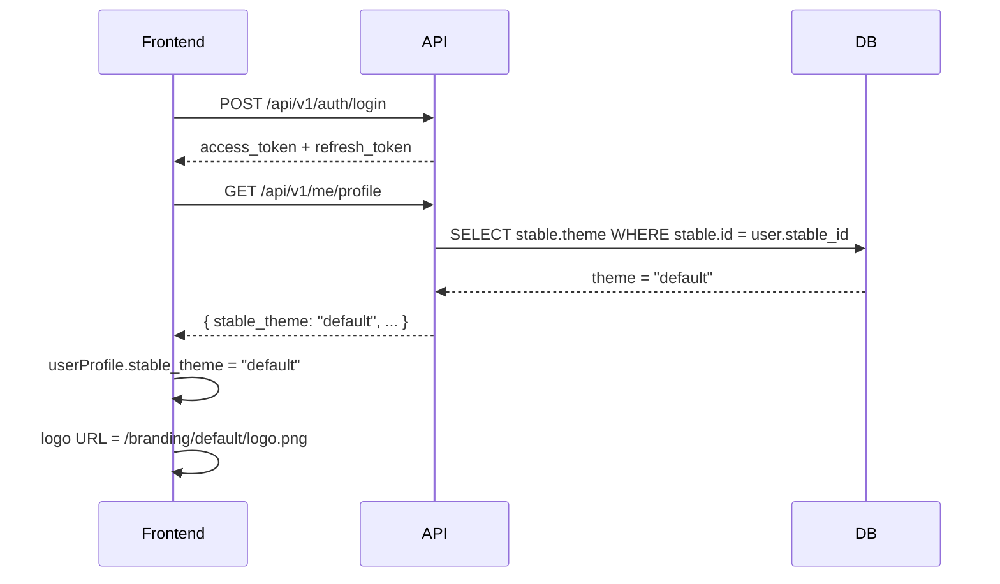

# Feature: Branding por Tema de Base de Datos

## Descripcion

El sistema de branding permite personalizar el aspecto visual (logo, colores, assets) de la aplicacion segun la hipica que accede. Anteriormente se detectaba el tema por subdominio (clave fija `"demo"`). Ahora el tema se obtiene directamente de la base de datos a traves de la columna `stable.theme`.

## Motivacion del Cambio

El enfoque por subdominio era fragil: dependia de la URL del navegador y dificultaba despliegues en entornos de staging o con multiples dominios. Centralizar el tema en la BD garantiza coherencia independientemente del origen de la peticion.

## Flujo



## Componentes Afectados

### Backend

- **`app/models/stable.py`** — columna `theme: Optional[str]` con default `"default"`.
- **`app/api/v1/endpoints/me.py`** — `GET /me/profile` y `PUT /me/profile` leen `stable.theme` y lo exponen como `stable_theme`.

### Frontend

- **`index.html`** — bootstrap inicial: el fallback de tema cambia de `"demo"` a `"default"`. Se aplica antes de montar Vue, para cargar assets criticos.
- **`public/branding/`** — carpeta renombrada de `demo/` a `default/`. Contiene logo y assets del tema por defecto.
- **`src/layouts/MainLayout.vue`** — construye la URL del logo dinamicamente: `/branding/${userProfile.stable_theme}/${branding.logo}`.
- **`src/views/Stables.vue`** — campo `theme` (texto libre) disponible en el dialogo de edicion de hipicas. Solo accesible para `app_admin`.

## Estructura de Carpetas de Branding

```
public/
└── branding/
    ├── default/         # Antes "demo/" — tema generico de la aplicacion
    │   ├── logo.png
    │   └── ...
    └── <otro-tema>/     # Temas personalizados por cliente futuro
        └── logo.png
```

## Modelo de Datos

| Tabla | Columna | Tipo | Default | Descripcion |
|-------|---------|------|---------|-------------|
| `stable` | `theme` | `VARCHAR` (nullable) | `"default"` | Identificador de la carpeta de branding a usar |

## Consideraciones

- Si `stable.theme` es `null` en BD, el backend devuelve `"default"` como valor de seguridad.
- El `app_admin` puede cambiar el tema de cualquier hipica desde la vista `Stables.vue`. El campo no tiene validacion de valores posibles a nivel de API; se gestiona por convencion de carpetas.
- Para anadir un nuevo tema basta con crear la carpeta `public/branding/<nombre-tema>/` con los assets correspondientes e indicar ese nombre en `stable.theme`.
