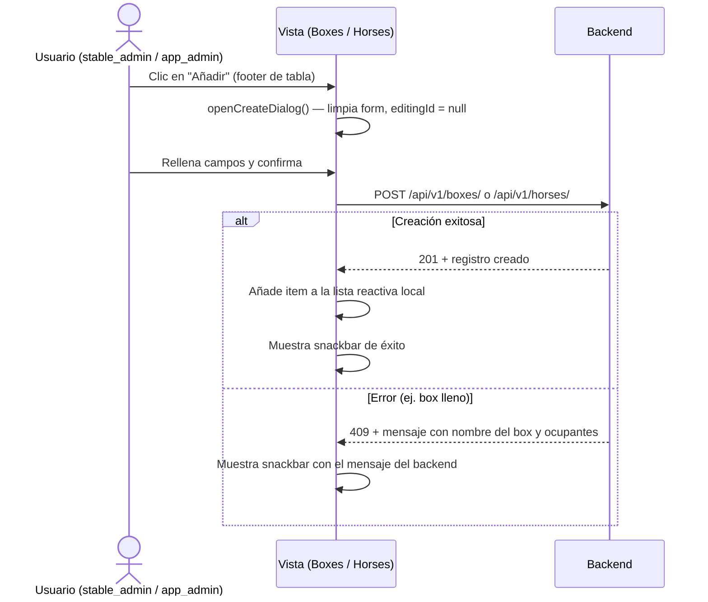
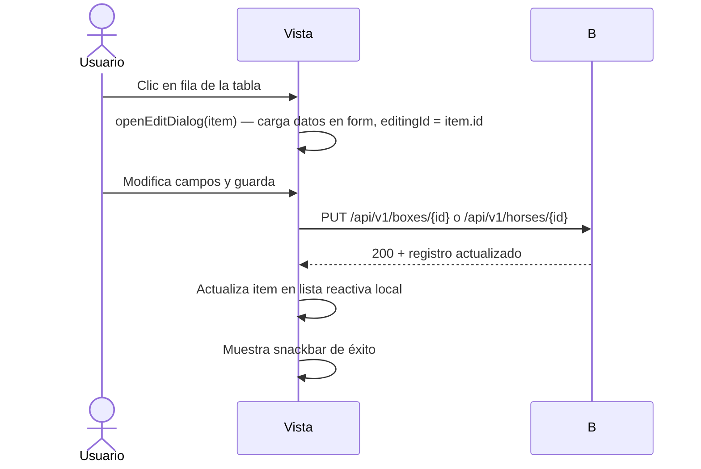
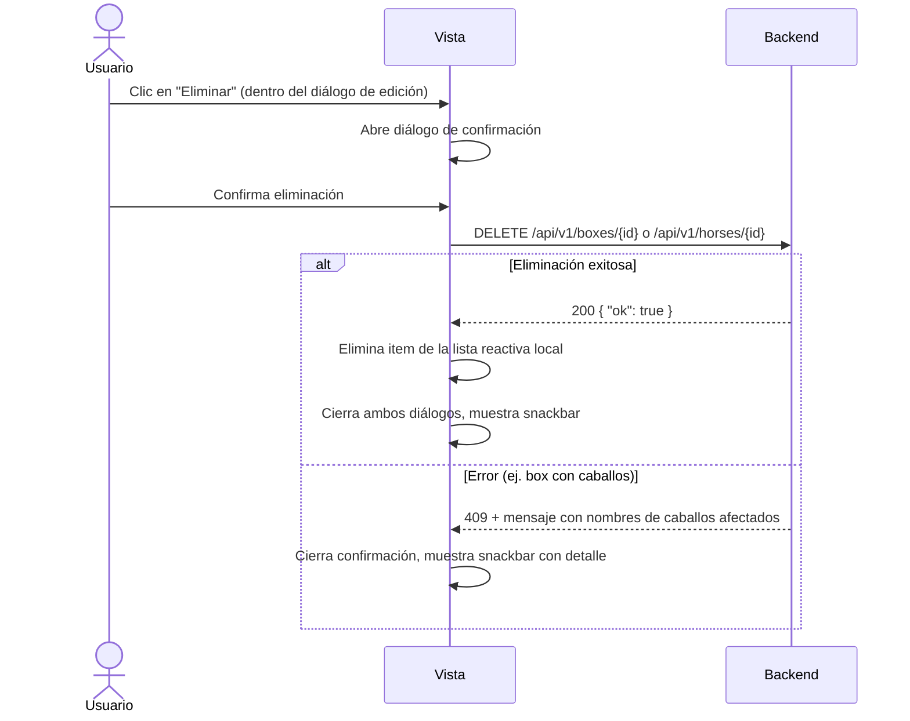

# Feature: CRUD de Boxes y Caballos con UX Mejorada

## Descripción

Las vistas de Boxes (`/boxes`) y Caballos (`/horses`) implementan un patrón de CRUD unificado con las siguientes características:

- Tabla con búsqueda, ordenación y exportación a Excel.
- Diálogo único para crear y editar registros (el título cambia según el contexto).
- Botón "Añadir" en el footer de la tabla, visible solo para roles con permisos de escritura (`canManage`).
- Botón "Eliminar" dentro del diálogo de edición, con diálogo de confirmación independiente.
- Selector de hípica en el formulario, visible exclusivamente para `app_admin`.
- Mensajes de error detallados del backend mostrados directamente en el snackbar.

---

## Flujo de usuario

### Crear un registro

### Editar un registro

### Eliminar un registro

---

## Control de acceso por rol (canManage)

La variable `canManage` es un `computed` exportado desde `src/auth/profile.ts`. Es `true` para los roles `stable_admin` y `app_admin`, y `false` para `monitor` y `client`.

| Elemento de UI | Condición de visibilidad |
|----------------|-------------------------|
| Botón "Añadir" en el footer | `canManage === true` |
| Botón "Eliminar" en el diálogo | `editingId !== null && canManage === true` |
| Selector de hípica en el formulario | `isAppAdmin === true` |

Los monitores pueden consultar la lista y ver los detalles pero no pueden crear, modificar ni eliminar registros.

---

## Mensajes de error detallados

### Error: box lleno al asignar un caballo

Cuando se intenta crear o editar un caballo asignándole un box sin capacidad disponible, el backend devuelve un error 409 con un mensaje que incluye el nombre del box, su capacidad y los nombres de los caballos que ya lo ocupan.

El backend construye el mensaje así:
- Clave i18n: `box.full`
- Parámetros: `box_name`, `capacity`, `horse_names` (lista separada por comas)

El frontend muestra directamente `e?.response?.data?.detail` en el snackbar, por lo que el mensaje llega con todo el contexto al usuario sin transformaciones adicionales.

### Error: box con caballos al eliminar

Cuando se intenta eliminar un box que tiene caballos asignados, el backend devuelve 409 con un mensaje que incluye los nombres de los caballos afectados.

- Clave i18n: `box.has_horses`
- Parámetro: `horse_names` (lista separada por comas)

---

## Selector de hípica para app_admin

Cuando el usuario tiene rol `app_admin`, el formulario del diálogo muestra un campo `v-select` para elegir la hípica destino del registro. Para `stable_admin`, ese campo no aparece y el backend ignora cualquier `stable_id` enviado, forzando el de su propia hípica.

La vista carga la lista de hípicas disponibles (`GET /api/v1/stables`) únicamente si `isAppAdmin.value === true`, evitando una llamada innecesaria para el resto de roles.

---

## Endpoints involucrados

### Boxes

| Método | Ruta | Rol mínimo | Descripción |
|--------|------|-----------|-------------|
| GET | `/api/v1/boxes/` | `monitor` | Listar boxes de la hípica |
| POST | `/api/v1/boxes/` | `stable_admin` | Crear box |
| PUT | `/api/v1/boxes/{id}` | `stable_admin` | Actualizar box |
| DELETE | `/api/v1/boxes/{id}` | `stable_admin` | Eliminar box (falla con 409 si tiene caballos) |

### Caballos

| Método | Ruta | Rol mínimo | Descripción |
|--------|------|-----------|-------------|
| GET | `/api/v1/horses/` | `monitor` | Listar caballos de la hípica |
| POST | `/api/v1/horses/` | `stable_admin` | Crear caballo |
| PUT | `/api/v1/horses/{id}` | `stable_admin` | Actualizar caballo (incluye niveles) |
| DELETE | `/api/v1/horses/{id}` | `stable_admin` | Eliminar caballo |
| GET | `/api/v1/stables/` | `app_admin` | Listar hípicas (solo si isAppAdmin) |

---

## Modelos afectados

- `Box` — campos: `id`, `name`, `capacity`, `stable_id`, `is_active`; relación: `horses` (backref)
- `Horse` — campos: `id`, `name`, `box_id`, `stable_id`, `is_active`; relaciones: `box` (FK), `levels` (N:N vía `HorseLevelLink`)

---

## Componentes involucrados

| Archivo | Responsabilidad |
|---------|----------------|
| `src/views/Boxes.vue` | CRUD completo de boxes con diálogo unificado y confirmación de borrado |
| `src/views/Horses.vue` | CRUD completo de caballos; incluye selector de niveles con chips |
| `src/auth/profile.ts` | Exporta `canManage` e `isAppAdmin` |
| `src/types/api.ts` | Tipos `Box`, `Horse`, `Stable` |
| `app/api/v1/endpoints/box.py` | CRUD backend de boxes; validación de caballos al eliminar |
| `app/api/v1/endpoints/horse.py` | CRUD backend de caballos; validación de capacidad de box |

---

## Consideraciones

- La actualización local de la lista tras crear o editar (sin recargar desde el backend) es intencional para dar respuesta inmediata al usuario. Si el backend devuelve el objeto actualizado en el response, ese objeto reemplaza el anterior en la lista reactiva.
- Al eliminar, el item se filtra de la lista local solo si la llamada al backend devuelve 200.
- Las acciones "Guardar" y "Eliminar" tienen estados de carga independientes (`saving` y `deleting`) para evitar interacción doble durante las peticiones.
