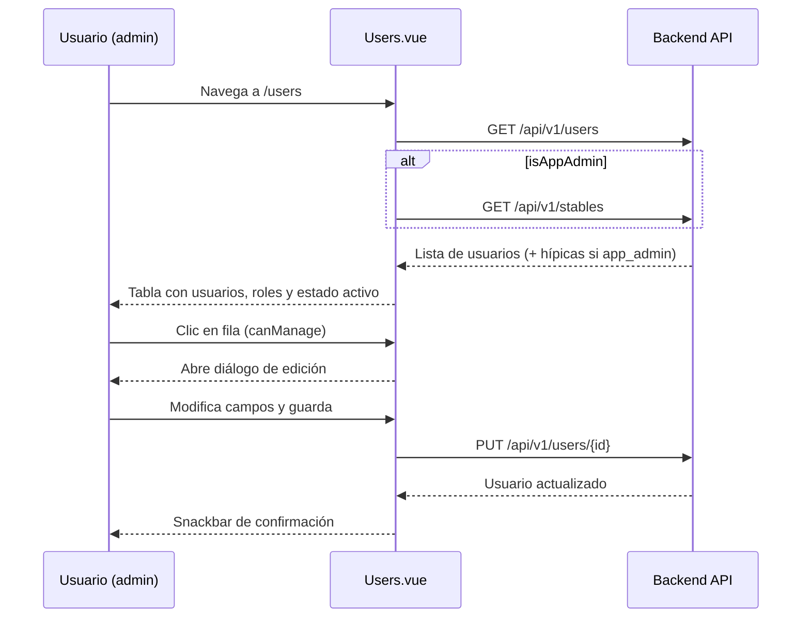

# Feature: Gestión de Usuarios

## Descripción

Permite a los administradores crear, consultar, editar y eliminar los usuarios de la aplicación. La vista es accesible desde la sección **Administración** del menú lateral y está restringida a los roles `stable_admin` y `app_admin`. Cada rol tiene capacidades distintas, tanto sobre qué datos puede ver como sobre qué acciones puede ejecutar.

---

## Ruta

```
/users
```

Protegida por el guard global del router (`requiresAuth: true`). La visibilidad de la entrada en el menú de navegación se controla mediante la propiedad `adminOnly` de `NavSection`, que oculta la sección completa a roles sin permisos de gestión.

---

## Actores y Control de Acceso

| Acción | `monitor` | `client` | `stable_admin` | `app_admin` |
|---|---|---|---|---|
| Acceder a la vista | No | No | Sí | Sí |
| Ver listado de usuarios | — | — | Sí (su hípica) | Sí (todas las hípicas) |
| Crear usuario | — | — | Sí | Sí |
| Editar usuario | — | — | Sí | Sí |
| Eliminar usuario | — | — | No | Sí |
| Asignar rol `app_admin` o `stable_admin` | — | — | No | Sí |
| Seleccionar hípica destino al crear/editar | — | — | No | Sí |

La lógica de permisos se deriva de dos computed reactivos importados de `src/auth/profile.ts`:

- **`canManage`**: `true` si el rol es `app_admin` o `stable_admin`. Controla la visibilidad del botón "Añadir usuario" y la apertura del diálogo al hacer clic en una fila.
- **`isAppAdmin`**: `true` exclusivamente para `app_admin`. Controla los campos adicionales del formulario y el botón de eliminar.

---

## Flujo Principal



---

## Tabla de Usuarios

La tabla (`v-data-table`) muestra las siguientes columnas con soporte de ordenación:

| Columna | Campo API | Ordenable | Notas |
|---|---|---|---|
| ID | `id` | Sí | |
| Nombre | `name` | Sí | |
| Email | `email` | Sí | |
| Rol | `role` | Sí | Chip con color diferenciado por rol |
| Hípica | `stable_id` | No | Se resuelve a nombre legible con mapa local |
| Activo | `is_active` | Sí | Icono check/close con color success/error |

### Colores de chip por rol

| Rol | Color Vuetify |
|---|---|
| `app_admin` | `error` (rojo) |
| `stable_admin` | `warning` (naranja) |
| `monitor` | `info` (azul) |
| `client` | `success` (verde) |

La tabla incluye un buscador en tiempo real que filtra por `name` y `email`. El mismo filtro se aplica al exportar.

---

## Formulario Crear / Editar

El diálogo es compartido para creación y edición; el modo se determina por `editingId` (null = creación).

### Campos del formulario

| Campo | Tipo | Obligatorio | Condicional | Descripción |
|---|---|---|---|---|
| Hípica | Select | No | Solo visible si `isAppAdmin` | Permite asignar el usuario a cualquier hípica del sistema |
| Nombre | Texto | Sí | — | Nombre completo del usuario |
| Email | Email | Sí | — | Dirección de correo electrónico |
| Contraseña | Password | Sí en creación | Solo visible si `!editingId` (modo creación) | No se envía en edición |
| Rol | Select | Sí | Opciones filtradas según rol del actor | Ver tabla de roles disponibles |
| Activo | Switch | — | — | Estado de activación de la cuenta |

### Roles disponibles según el actor

| Actor | Roles asignables |
|---|---|
| `stable_admin` | `monitor`, `client` |
| `app_admin` | `app_admin`, `stable_admin`, `monitor`, `client` |

Esta restricción se aplica en el frontend mediante `availableRoles` (computed que filtra el array según `isAppAdmin`). La validación definitiva debe ser reforzada también en el backend.

### Payload de creación (`POST /api/v1/users/`)

```json
{
  "name": "string",
  "email": "string",
  "password": "string",
  "role": "monitor | client | stable_admin | app_admin",
  "is_active": true,
  "stable_id": null
}
```

El campo `stable_id` solo se incluye si `isAppAdmin` y el campo tiene valor.

### Payload de edición (`PUT /api/v1/users/{id}`)

```json
{
  "name": "string",
  "email": "string",
  "role": "monitor | client | stable_admin | app_admin",
  "is_active": true,
  "stable_id": null
}
```

La contraseña no se envía en edición. El campo `stable_id` solo se incluye si `isAppAdmin`.

---

## Eliminación de Usuarios

El botón de eliminar solo aparece en el diálogo de edición (`editingId !== null`) y únicamente si `isAppAdmin`. El flujo es:

1. `app_admin` abre el diálogo de edición de un usuario.
2. Pulsa el botón "Eliminar".
3. Se abre un diálogo de confirmación secundario (`confirmDeleteDialog`).
4. Tras confirmar, se llama a `DELETE /api/v1/users/{id}`.
5. El usuario se elimina del array local y se muestran ambos diálogos cerrados con snackbar de confirmación.

---

## Integración con la API

| Método | Endpoint | Actor | Descripción |
|---|---|---|---|
| `GET` | `/api/v1/users` | `stable_admin`, `app_admin` | Lista usuarios. El backend filtra por `stable_id` del token (multi-tenant) salvo para `app_admin`, que ve todos |
| `GET` | `/api/v1/stables` | `app_admin` | Lista todas las hípicas. Solo se llama si `isAppAdmin` para poblar el select de hípica |
| `POST` | `/api/v1/users/` | `stable_admin`, `app_admin` | Crea un usuario nuevo |
| `PUT` | `/api/v1/users/{id}` | `stable_admin`, `app_admin` | Actualiza los datos de un usuario existente |
| `DELETE` | `/api/v1/users/{id}` | `app_admin` | Elimina un usuario. Restringido a `app_admin` en frontend |

Todas las peticiones HTTP se realizan a través de `src/api/http.ts`, que gestiona los interceptors de autenticación (cabecera `Authorization: Bearer`) y refresco de token automático.

---

## Exportación a Excel

La tabla permite exportar el listado visible (respetando el filtro de búsqueda activo) a un fichero `.xlsx` mediante la librería `xlsx`. El botón está deshabilitado si no hay usuarios cargados.

Las columnas exportadas son: ID, Nombre, Email, Rol (traducido), Hípica (nombre legible) y Activo.

---

## Modelos afectados

- `User` — entidad principal gestionada
- `Stable` — referenciada para mostrar el nombre de la hípica y para el selector del formulario (`app_admin`)

### Tipo TypeScript (`src/types/api.ts`)

```typescript
export type UserRead = {
  id: number;
  name: string;
  email: string;
  role: string;
  stable_id: number | null;
  is_active: boolean;
};
```

---

## Consideraciones

- La restricción de roles asignables (`stable_admin` no puede crear `app_admin` ni `stable_admin`) se aplica en el frontend. Debe existir validación equivalente en el backend para evitar escalada de privilegios por llamadas directas a la API.
- El campo `stable_id` en la edición solo se envía si `isAppAdmin`. Un `stable_admin` editando un usuario siempre mantiene el `stable_id` original del usuario (lo gestiona el backend según el token).
- La columna "Hípica" en la tabla se resuelve localmente con un mapa `id → nombre` construido a partir de la lista de hípicas. Si `stable_admin` accede, no carga hípicas y mostrará el `id` numérico en caso de no encontrar el nombre.
- No hay paginación server-side; la tabla carga todos los usuarios de la hípica en un único request y delega filtrado y ordenación al componente `v-data-table`.
