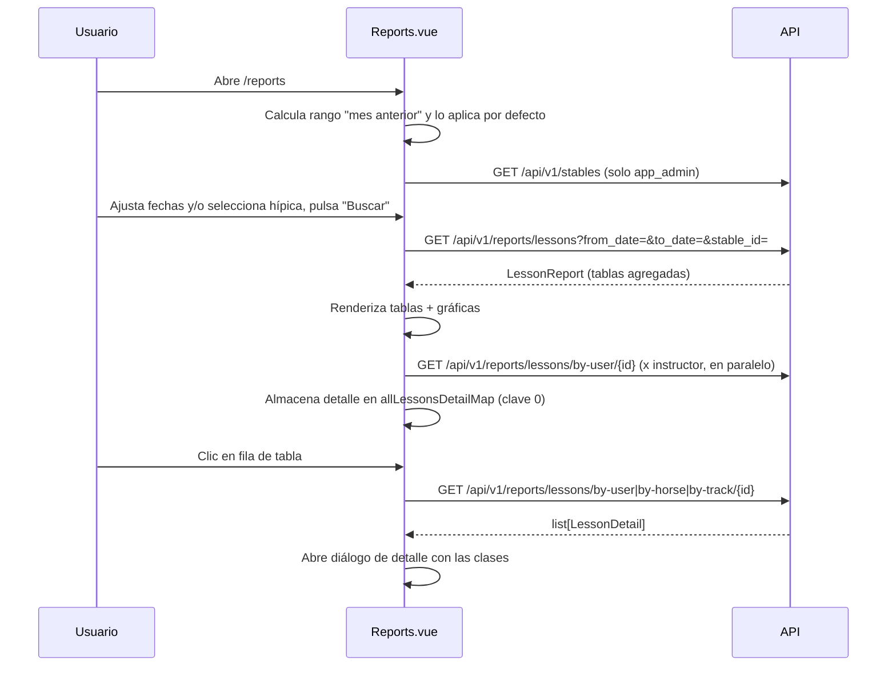

# Feature: Informes Agregados

## Descripción

El módulo de informes ofrece una vista analítica del período seleccionado. Muestra tablas resumen por instructor, ayudante, alumno, caballo y pista, con capacidad de hacer drill-down a las clases individuales de cada entidad. Incluye tres gráficas de barras (ApexCharts): horas por caballo top-5, horas por personal top-5 y distribución de clases por día de la semana con filtros por entidad.

## Flujo de Usuario



## Acceso a la Vista

- Ruta: `/reports`
- Roles con acceso: `monitor`, `stable_admin`, `app_admin`
- La ruta tiene `meta: { requiresAuth: true }`
- Archivo: `hipica-frontend/src/views/Reports.vue`

## Filtros Globales

| Filtro | Descripción |
|--------|-------------|
| Hípica | Solo visible para `app_admin`. Selector que filtra los datos a una hípica concreta. Si se deja en blanco, devuelve datos de todas las hípicas. |
| Fecha desde | `from_date` — inicio del período (inclusive). Por defecto: primer día del mes anterior. |
| Fecha hasta | `to_date` — fin del período (inclusive). Por defecto: último día del mes anterior. |

Las fechas por defecto se calculan en el método `getPreviousMonthRange()` al montar el componente, sin necesidad de que el usuario las rellene manualmente.

## Tablas del Informe

Todas las tablas se renderizan al recibir la respuesta de `GET /api/v1/reports/lessons`. Cada fila es interactiva: al hacer clic se abre el diálogo de drill-down.

| Tabla | Columnas | Orden |
|-------|----------|-------|
| Instructores | Nombre, Horas, Nº clases | Horas desc |
| Ayudantes | Nombre, Horas, Nº clases | Horas desc |
| Alumnos | Nombre, Nº clases, Horas | Nº clases desc |
| Caballos | Nombre, Horas | Horas desc |
| Pistas | Nombre, Nº clases, Horas | Horas desc |

La duración de cada clase se calcula como `end_time - date_time`. Si una clase no tiene `end_time`, se asume 1 hora por defecto (lógica en `_lesson_duration_hours` del backend).

## Drill-down

Al hacer clic en cualquier fila de las tablas anteriores, se abre un diálogo modal con el detalle de las clases de esa entidad en el período seleccionado.

| Columna | Descripción |
|---------|-------------|
| Fecha/hora | ISO datetime de inicio de la clase |
| Duración (h) | Horas calculadas |
| Pista | Nombre de la pista, si está asignada |
| Instructor | Nombre del instructor de la clase |

Los endpoints de drill-down aceptan los mismos parámetros de fecha y `stable_id` que el informe principal.

## Gráficas (ApexCharts)

### Horas por caballo — top-5

- Tipo: barras verticales
- Datos: los primeros 5 elementos de `horse_hours` (ya ordenados desc por horas)
- Eje X: nombre del caballo; Eje Y: horas

### Horas por personal — top-5

- Tipo: barras verticales
- Datos: combinación de `instructor_hours` y `helper_hours`, ordenados desc por horas, top 5
- Eje X: nombre del usuario; Eje Y: horas

### Distribución por día de la semana

- Tipo: barras verticales
- Eje X: días de la semana (Dom–Sáb según índice `Date.getDay()`)
- Eje Y: número de clases
- Datos base: se calculan en `loadAllLessonsForChart` concatenando los detalles de clases de todos los instructores del período, deduplicados por `lesson_id`

#### Filtros de la gráfica de días

Permite superponer series independientes por entidad seleccionada:

| Tipo de filtro | Entidades disponibles |
|----------------|----------------------|
| Todas (sin filtro) | Serie única con todas las clases del período |
| Caballos | Cada caballo del informe como serie independiente |
| Alumnos | Cada alumno del informe |
| Instructores | Cada instructor del informe |
| Ayudantes | Cada ayudante del informe |
| Pistas | Cada pista del informe |

Se puede seleccionar múltiples entidades simultáneamente. Cada entidad aparece como una barra de color distinto (paleta `CHART_COLORS` de 10 colores). El tooltip muestra el número de clases al hacer hover. Los datos de cada entidad se cargan bajo demanda: la primera vez que una entidad se selecciona se llama al endpoint correspondiente; si ya fue cargada en la sesión, se reutiliza el mapa `allLessonsDetailMap`.

Un botón "Seleccionar todo / Deseleccionar todo" permite gestionar la selección masiva.

Al cambiar el tipo de filtro, la selección de entidades se reinicia automáticamente.

## Endpoints del Backend

Archivo: `app/api/v1/endpoints/reports.py`

### `GET /api/v1/reports/lessons`

Devuelve el informe agregado completo para el rango de fechas indicado.

**Query params:** `from_date` (date), `to_date` (date), `stable_id` (int, solo `app_admin`)

**Roles:** `monitor`, `stable_admin`, `app_admin`

**Respuesta (`LessonReport`):**

```json
{
  "instructor_hours": [{ "user_id": 1, "name": "...", "email": "...", "hours": 12.5, "class_count": 10 }],
  "helper_hours":     [{ "user_id": 2, "name": "...", "email": "...", "hours": 4.0,  "class_count": 4  }],
  "student_classes":  [{ "user_id": 3, "name": "...", "class_count": 8, "hours": 8.0 }],
  "horse_hours":      [{ "horse_id": 1, "name": "...", "hours": 10.0 }],
  "track_hours":      [{ "track_id": 1, "name": "...", "class_count": 6, "hours": 6.0 }],
  "from_date": "2025-03-01",
  "to_date":   "2025-03-31"
}
```

### `GET /api/v1/reports/lessons/by-user/{user_id}`

Devuelve el detalle de clases de un usuario (como instructor, ayudante o alumno).

**Roles:** `monitor`, `stable_admin`, `app_admin`

### `GET /api/v1/reports/lessons/by-horse/{horse_id}`

Devuelve el detalle de clases donde participó un caballo concreto.

**Roles:** `monitor`, `stable_admin`, `app_admin`

### `GET /api/v1/reports/lessons/by-track/{track_id}`

Devuelve el detalle de clases celebradas en una pista concreta.

**Roles:** `monitor`, `stable_admin`, `app_admin`

**Respuesta común a los tres endpoints de drill-down (`list[LessonDetail]`):**

```json
[
  {
    "lesson_id": 42,
    "date_time": "2025-03-10T10:00:00",
    "end_time":  "2025-03-10T11:00:00",
    "duration_hours": 1.0,
    "track_name": "Pista 1",
    "instructor_name": "Nombre Instructor"
  }
]
```

## Multi-tenant

El backend aplica el `stable_id` del usuario autenticado automáticamente. `app_admin` puede pasar `stable_id` como parámetro para filtrar a una hípica concreta, o dejarlo vacío para obtener datos de todas las hípicas. El resto de roles siempre ven solo los datos de su cuadra.

## Modelos Afectados

- `Lesson` — fuente principal de datos
- `LessonUserLink` — enlace alumno-clase
- `LessonHorseLink` — enlace caballo-clase
- `Horse` — resolución de nombre para `horse_hours`
- `Track` — resolución de nombre para `track_hours`
- `User` — resolución de nombre para `instructor_hours`, `helper_hours`, `student_classes`

## Consideraciones

- La carga de la gráfica de días de la semana en modo "todas" hace una llamada por cada instructor del período; si hay muchos instructores, el número de peticiones puede ser significativo.
- El detalle de drill-down de un usuario combina en una sola respuesta las clases donde actuó como instructor, ayudante o alumno, deduplicadas por `lesson_id`.
- Las gráficas no se muestran si el informe está vacío (`isEmpty = true`).
- La vista no requiere que el usuario pulse "Buscar" manualmente al cargar: las fechas se inicializan, pero la carga del informe solo ocurre al pulsar el botón.
