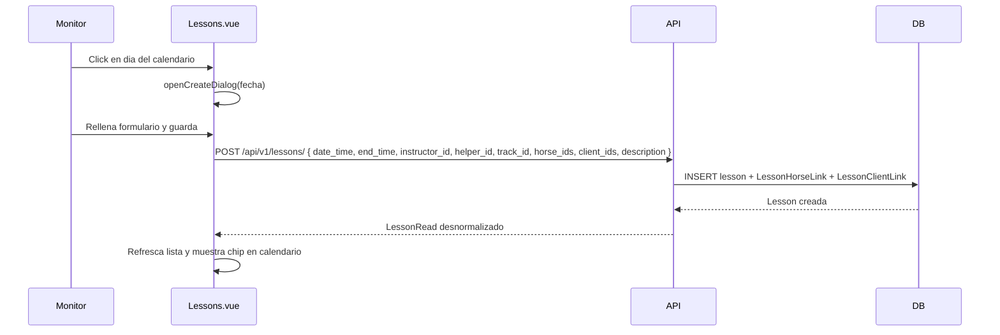

# Feature: Lessons con Calendario Semanal y Tracks

## Descripcion

La feature de Lessons (clases de equitacion) se expande con nuevos campos en el modelo, una nueva entidad `Track` (pista), una vista de calendario semanal en el frontend y un modulo de informes agregados.

## Nuevos Campos en `Lesson`

| Campo | Tipo | Default | Descripcion |
|-------|------|---------|-------------|
| `end_time` | `datetime \| null` | `null` | Hora de fin de la clase. Si no se indica, se asume 1 hora de duracion en los calculos de informes. |
| `helper_id` | `int \| null` | `null` | FK a `user.id`. Monitor ayudante (secundario) de la clase. |
| `track_id` | `int \| null` | `null` | FK a `track.id`. Pista donde se celebra la clase. |
| `description` | `str \| null` | `null` | Notas adicionales sobre la clase. |

## Nueva Entidad: Track (Pista)

Representa una pista fisica dentro de una hipica.

```
Track
  id        : int (PK)
  name      : str
  stable_id : int (FK → stable.id, index)
  is_active : bool (default: true)
```

El CRUD completo se expone bajo `/api/v1/tracks`. Ver `docs/api/tracks.md` para detalle de endpoints.

## Schema `LessonRead` Desnormalizado

La respuesta de los endpoints de Lesson incluye datos resueltos para evitar multiples llamadas desde el frontend:

| Campo | Tipo | Descripcion |
|-------|------|-------------|
| `instructor_email` | `str` | Email del instructor principal |
| `helper_email` | `str \| null` | Email del ayudante (si existe) |
| `track_name` | `str \| null` | Nombre de la pista (si asignada) |
| `horse_names` | `list[str]` | Nombres de los caballos asignados |
| `client_names` | `list[str]` | Nombres de los alumnos participantes |

## Frontend: Calendario Semanal (`Lessons.vue`)

La vista abandona la tabla plana y adopta un calendario de semana vista con las siguientes caracteristicas:

- **Navegacion:** botones "Semana anterior" / "Hoy" / "Semana siguiente".
- **Grid semanal:** 7 columnas (lun–dom). El dia actual se resalta visualmente.
- **Chips de clase:** cada clase aparece como un chip en su dia con hora de inicio, nombre de pista (si existe) y email del instructor.
- **Crear clase:** click en una celda vacia del dia abre el dialogo de creacion con la fecha preseleccionada (solo para `canManage`).
- **Editar clase:** click en un chip abre el dialogo de edicion con todos los campos cargados.

### Dialogo de creacion/edicion

Campos disponibles:

| Campo | Tipo de control | Notas |
|-------|----------------|-------|
| Fecha y hora inicio | `datetime-local` | Requerido |
| Fecha y hora fin | `datetime-local` | Opcional |
| Instructor | `v-select` | Lista de usuarios de la hipica |
| Ayudante | `v-select` | Lista de usuarios + opcion "ninguno" |
| Pista | `v-select` | Lista de tracks activos + opcion "ninguna" |
| Caballos | `v-select` multiple | Chips con nombre de caballo |
| Alumnos | `v-select` multiple | Chips con nombre de cliente |
| Descripcion | `v-textarea` | Notas adicionales |

## Frontend: Informes (`Reports.vue`)

Vista nueva en el area de Administracion. Consume `GET /api/v1/reports/lessons` y presenta los resultados en cuatro tablas:

| Tabla | Datos mostrados |
|-------|----------------|
| Horas de instructor | Email + horas impartidas, ordenado desc |
| Horas de ayudante | Email + horas como ayudante, ordenado desc |
| Clases de alumnos | Nombre de cliente + numero de clases, ordenado desc |
| Horas de caballos | Nombre de caballo + horas trabajadas, ordenado desc |

El usuario selecciona un rango de fechas (`from_date` / `to_date`) y pulsa "Buscar" para cargar el informe. Si no se indican fechas se devuelven todas las clases de la hipica.

### Acceso a la vista de informes

- Ruta: `/reports`
- Visible solo para `app_admin` en el menu lateral (`ADMIN_ITEMS` de `MainLayout.vue`).
- La ruta tiene `meta: { requiresAuth: true }`.

## Flujo de Datos — Crear Clase



## Consideraciones

- La duracion de una clase se calcula como `end_time - date_time`. Si `end_time` es `null`, los informes asumen 1 hora por defecto.
- El `instructor_id` se puede especificar libremente en el body (no se fuerza al usuario autenticado), lo que permite que un `stable_admin` asigne clases a otros monitores.
- `track_id` se valida por integridad referencial en BD; el endpoint no comprueba que la pista pertenezca a la misma hipica que la clase (pendiente de reforzar).
- Los informes filtran por `stable_id` del usuario autenticado, excepto `app_admin` que ve datos de todas las hipicas.
