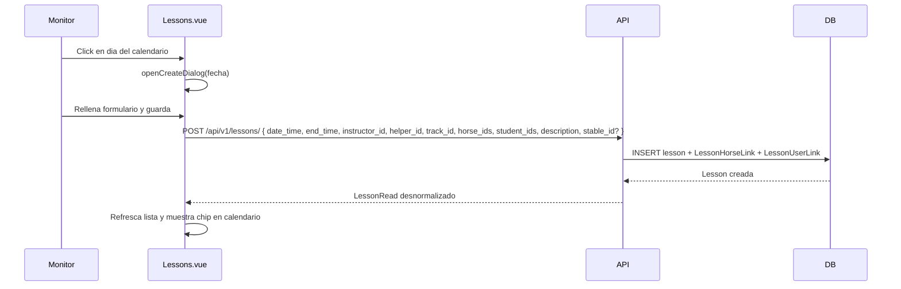

# Feature: Lessons con Calendario Semanal y Tracks

## Descripcion

La feature de Lessons (clases de equitacion) se expande con nuevos campos en el modelo, una nueva entidad `Track` (pista), una vista de calendario semanal en el frontend y un modulo de informes agregados.

## Nuevos Campos en `Lesson`

| Campo | Tipo | Default | Descripcion |
|-------|------|---------|-------------|
| `end_time` | `datetime \| null` | `null` | Hora de fin de la clase. Si no se indica, se asume 1 hora de duracion en los calculos de informes. |
| `helper_id` | `int \| null` | `null` | FK a `user.id`. Monitor ayudante (secundario) de la clase. |
| `track_id` | `int \| null` | `null` | FK a `track.id`. Pista donde se celebra la clase. |
| `description` | `str \| null` | `null` | Notas adicionales sobre la clase. |

## Nueva Entidad: Track (Pista)

Representa una pista fisica dentro de una hipica.

```
Track
  id        : int (PK)
  name      : str
  stable_id : int (FK → stable.id, index)
  is_active : bool (default: true)
```

El CRUD completo se expone bajo `/api/v1/tracks`. Ver `docs/api/tracks.md` para detalle de endpoints.

## Schema `LessonRead` Desnormalizado

La respuesta de los endpoints de Lesson incluye datos resueltos para evitar multiples llamadas desde el frontend:

| Campo | Tipo | Descripcion |
|-------|------|-------------|
| `instructor_email` | `str` | Email del instructor principal |
| `helper_email` | `str \| null` | Email del ayudante (si existe) |
| `track_name` | `str \| null` | Nombre de la pista (si asignada) |
| `horse_names` | `list[str]` | Nombres de los caballos asignados |
| `client_names` | `list[str]` | Nombres de los alumnos participantes |

## Frontend: Calendario (`Lessons.vue`)

La vista adopta un calendario con dos modos de visualizacion intercambiables mediante un toggle:

### Toggle semana / mes

Boton `v-btn-toggle` en el header derecho con opciones `week` y `month`. El estado se guarda en `viewMode` (ref).

### Vista semanal

- **Navegacion:** botones "Semana anterior" / "Hoy" / "Semana siguiente".
- **Grid semanal:** 7 columnas (lun–dom). El dia actual se resalta.
- **Chips de clase:** hora de inicio, pista (si existe), email instructor.
- **Crear clase:** click en celda vacia abre el dialogo con la fecha preseleccionada.

### Vista mensual

- **Navegacion:** botones "Mes anterior" / "Hoy" / "Mes siguiente" (los mismos botones del centro cambian dinamicamente segun `viewMode`).
- **Grid mensual:** `month-grid` con `grid-template-columns: repeat(7, 1fr)`. Incluye dias del mes anterior/siguiente para completar filas de 7; esos dias se renderizan con `opacity: 0.4`.
- **Cabecera:** dias de la semana abreviados (lun, mar, ...) derivados de una semana de referencia con `toLocaleDateString`.
- **Chips de clase:** identicos a la vista semanal.

Computed relevantes:
- `monthDays`: array de `{ iso, dayNum, isToday, isCurrentMonth }` con todos los dias del grid mensual.
- `monthWeekHeaders`: array con los 7 nombres abreviados de dia de la semana (Lun–Dom).

### Dialogo de creacion/edicion

| Campo | Control | Notas |
|-------|---------|-------|
| **Hipica** | `v-select` | Solo visible para `app_admin`. Requerido al crear. |
| Fecha y hora inicio | `datetime-local` | Requerido |
| Fecha y hora fin | `datetime-local` | Auto-relleno con inicio + 1h si esta vacio o es anterior al inicio |
| Instructor | `v-select` | Solo usuarios con rol `monitor` |
| Ayudante | `v-select` | Solo usuarios con rol `assistant`, con opcion para dejar en blanco |
| Pista | `v-select` | Solo pistas activas de la hipica, con opcion para dejar en blanco |
| Caballos | `v-select` multiple | Chips, solo caballos activos |
| Alumnos | `v-select` multiple | Chips, solo usuarios activos con rol `client` |
| Asignacion alumno-caballo | Filas dinamicas | Visible cuando hay alumnos seleccionados. Ver seccion siguiente. |
| Descripcion | `v-textarea` | Notas adicionales |

El campo **Hipica** es necesario porque `app_admin` no tiene `stable_id` propio. Para otros roles, el backend fuerza `stable_id = current_user.stable_id` y el campo no se muestra.

### Emparejamiento alumno-caballo

Cuando hay alumnos seleccionados en el dialogo, aparece automaticamente una seccion de asignacion que muestra una fila por cada alumno. Cada fila contiene el nombre del alumno y un selector de caballo restringido a los caballos ya seleccionados en la clase.

La estructura interna que gestiona estos datos es `studentHorsePairs: StudentHorsePair[]`:

```typescript
interface StudentHorsePair {
  student_id: number;
  horse_id: number | null;
}
```

Los pares se calculan mediante un `watch` sobre `form.student_ids`: al añadir un alumno se crea una entrada con `horse_id = null`; al eliminar un alumno, su entrada desaparece. Si al editar una clase ya existen pares guardados (`lesson.student_horse_pairs`), se restauran en el dialogo.

Un segundo `watch` sobre `form.horse_ids` limpia automaticamente la asignacion de cualquier caballo que se haya deseleccionado de la clase, poniendo su `horse_id` a `null`.

#### Validaciones al guardar

| Condicion | Error mostrado |
|-----------|---------------|
| `end_time` es anterior o igual a `date_time` | `lessons.dialog.endBeforeStart` |
| Numero de caballos != numero de alumnos (y ambos > 0) | `lessons.dialog.horseStudentMismatch` |
| Algun alumno tiene `horse_id = null` | `lessons.dialog.unassignedPair` |
| Un mismo caballo asignado a dos alumnos distintos | `lessons.dialog.duplicateHorse` (alerta visible en el formulario) |

Las validaciones se ejecutan en orden antes de llamar a la API. Si alguna falla, se muestra un `v-snackbar` de error y no se realiza la peticion.

#### Chips del calendario

Los chips de clase en las vistas semanal y mensual muestran:
- Hora de inicio de la clase (formato `HH:MM`)
- Nombre de la pista entre parentesis, si esta asignada

Al hacer hover sobre un chip, el tooltip muestra:
- Nombre del instructor (resuelto desde `users[]` por `instructor_id`; si no se encuentra, se usa `instructor_email`)
- Nombre del primer alumno de la clase; si hay mas de uno, se añade ` …`

#### Persistencia en el backend

Los pares se envian en el payload de creacion y edicion:

```json
{
  "student_horse_pairs": [
    { "student_id": 3, "horse_id": 7 },
    { "student_id": 5, "horse_id": 2 }
  ]
}
```

El campo `horse_id` en `LessonUserLink` almacena la asignacion. Es opcional (`null` si el alumno no monta a caballo en esa clase).

## Frontend: Informes (`Reports.vue`)

Vista accesible para `monitor`, `stable_admin` y `app_admin`. Consume `GET /api/v1/reports/lessons` y presenta los resultados en cinco tablas con drill-down, gráficas de barras y filtros por entidad. Ver documentacion completa en `docs/features/informes.md`.

Tablas disponibles:

| Tabla | Datos mostrados |
|-------|----------------|
| Instructores | Nombre + horas impartidas + nº clases, ordenado desc |
| Ayudantes | Nombre + horas como ayudante + nº clases, ordenado desc |
| Alumnos | Nombre + nº clases + horas, ordenado desc |
| Caballos | Nombre + horas trabajadas, ordenado desc |
| Pistas | Nombre + nº clases + horas, ordenado desc |

El usuario selecciona un rango de fechas (`from_date` / `to_date`) y pulsa "Buscar". Las fechas se inicializan por defecto al mes anterior al cargar la vista.

### Acceso a la vista de informes

- Ruta: `/reports`
- Roles: `monitor`, `stable_admin`, `app_admin`
- La ruta tiene `meta: { requiresAuth: true }`.

## Flujo de Datos — Crear Clase



## Consideraciones

- La duracion de una clase se calcula como `end_time - date_time`. Si `end_time` es `null`, los informes asumen 1 hora por defecto.
- El `instructor_id` se puede especificar libremente en el body (no se fuerza al usuario autenticado), lo que permite que un `stable_admin` asigne clases a otros monitores.
- `track_id` se valida por integridad referencial en BD; el endpoint no comprueba que la pista pertenezca a la misma hipica que la clase (pendiente de reforzar).
- Los informes filtran por `stable_id` del usuario autenticado, excepto `app_admin` que ve datos de todas las hipicas.
