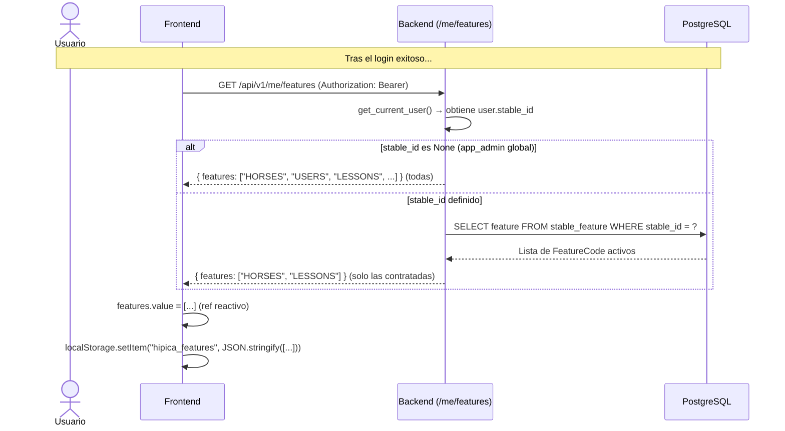

# Feature: Licenciamiento por Features

## Descripción

El sistema de licenciamiento por features permite que cada hípica tenga activados únicamente los módulos funcionales que ha contratado. No es un sistema de permisos de usuario (eso lo gestiona `require_role`), sino un sistema de **licencias a nivel de cuadra**: si una hípica no tiene activado el módulo `LESSONS`, ese módulo no existe en su instancia de la aplicación.

La motivación es comercial: Hipica es una plataforma multi-tenant donde distintas hípicas pueden tener planes de suscripción diferentes con acceso a distintos conjuntos de funcionalidades.

---

## Catálogo de Features

Definido como enum en `app/models/feature.py`:

| Código | Módulo | Secciones de menú incluidas |
|--------|--------|-----------------------------|
| `HORSES` | Gestión de caballos y boxes | Caballos, Boxes |
| `USERS` | Gestión de usuarios de la hípica | Usuarios |
| `LESSONS` | Gestión de clases y pistas | Clases, Pistas |
| `BOOKINGS` | Reservas | — |
| `BILLING` | Facturación | — |
| `REPORTING` | Informes y estadísticas | Informes |

> **Nota:** El código `CLIENTS` fue renombrado a `USERS` (migración `c1d2e3f4a5b6`) para reflejar que el módulo gestiona usuarios de la hípica (alumnos, monitores, ayudantes), no solo clientes.

---

## Flujo de Funcionamiento



Las features se cargan en dos momentos:
1. **Tras el login** — `Login.vue` llama a `fetchFeatures()` antes de redirigir a la app.
2. **Al montar `MainLayout.vue`** — Por si el usuario recarga la página con sesión activa; si no hay token, no se realiza la llamada.

---

## Modelo de Datos

```
Stable (1) ──< StableFeature (stable_id, feature)
                              └─ feature: FeatureCode (enum)
```

La tabla `stable_feature` tiene una clave primaria compuesta `(stable_id, feature)`, lo que garantiza que no puede haber duplicados y que cada par hípica-feature es único.

```python
class StableFeature(SQLModel, table=True):
    stable_id: int = Field(foreign_key="stable.id", primary_key=True)
    feature: FeatureCode = Field(primary_key=True)
```

---

## Componentes Involucrados

### Backend

| Archivo | Responsabilidad |
|---------|----------------|
| `app/models/feature.py` | Enum `FeatureCode` — catálogo de funcionalidades disponibles |
| `app/models/stable_feature.py` | Tabla `StableFeature` — relación hípica ↔ features activas |
| `app/api/v1/endpoints/me.py` | Endpoint `GET /me/features` — devuelve las features del usuario autenticado |

### Frontend

| Archivo | Responsabilidad |
|---------|----------------|
| `src/features/features.ts` | Estado global reactivo (`ref<FeatureCode[]>`); `fetchFeatures()` carga desde backend y persiste en `localStorage`; `clearFeatures()` limpia en logout |
| `src/layouts/MainLayout.vue` | Define `OPERATIVA_ITEMS` con campo `feature` opcional; filtra inline con `computed` según `features.value` |
| `src/types/api.ts` | Tipo `FeatureCode` (union literal) y tipo `NavItem` con campo opcional `feature` |

---

## Uso en el Frontend

### Consultar si una feature está activa

El `ref` exportado desde `features.ts` es reactivo. Cualquier componente puede importarlo:

```typescript
import { features } from "@/features/features";

// En un computed o template:
const canSeeHorses = computed(() => features.value.includes("HORSES"));
```

### Filtrado del menú de navegación

`MainLayout.vue` define dos listas estáticas:

- **`ADMIN_ITEMS`** — visible solo para `app_admin` (sin feature gate): Usuarios, Informes, Hípicas, Niveles, Funcionalidades.
- **`OPERATIVA_ITEMS`** — visible para todos los roles autenticados, filtrado por feature activa:

```typescript
const operativaItems = computed(() =>
  OPERATIVA_ITEMS.filter((item) =>
    !item.feature || features.value.includes(item.feature)
  )
);
```

Los items sin campo `feature` pasan siempre; los que tienen `feature` solo se muestran si esa feature está activa en la hípica del usuario.

---

## Persistencia en localStorage

Las features se almacenan en `localStorage` bajo la clave `hipica_features` como array JSON. Esto permite que al recargar la página el menú se muestre correctamente sin esperar a la llamada al backend (que llega ligeramente después al montar el layout).

| Clave localStorage | Contenido |
|-------------------|-----------|
| `hipica_features` | `["HORSES", "LESSONS", ...]` |

La función `clearFeatures()` debe llamarse en el logout para evitar que un usuario diferente vea las features de la sesión anterior.

---

## Caso Especial: app_admin sin hípica

Un usuario con rol `app_admin` y `stable_id = None` representa un administrador global del sistema. En ese caso, el endpoint `/me/features` devuelve **todas las features del catálogo** sin consultar la base de datos. Esto permite gestionar la plataforma completa desde una sola cuenta.

---

## Decisiones Técnicas

| Decisión | Justificación |
|----------|--------------|
| Features como enum en backend | Garantiza un contrato estricto entre backend y frontend; evita strings arbitrarios en base de datos |
| PK compuesta en `StableFeature` | Unicidad garantizada a nivel de base de datos, sin lógica adicional en la aplicación |
| Estado reactivo con `ref` en Vue | Permite que cualquier componente reaccione automáticamente cuando cambian las features activas |
| Persistencia en `localStorage` | Evita un parpadeo de interfaz al recargar la página; la llamada al backend actualiza el estado en segundo plano |
| Separación de `features.ts` y `filter.ts` | Separa el estado/carga de la lógica de filtrado, facilitando los tests unitarios de cada parte |
| Sin feature flags en rutas del router | El filtrado ocurre solo en el menú; las rutas existen siempre. Una navegación directa por URL a una ruta sin feature activa no está bloqueada en esta versión |
