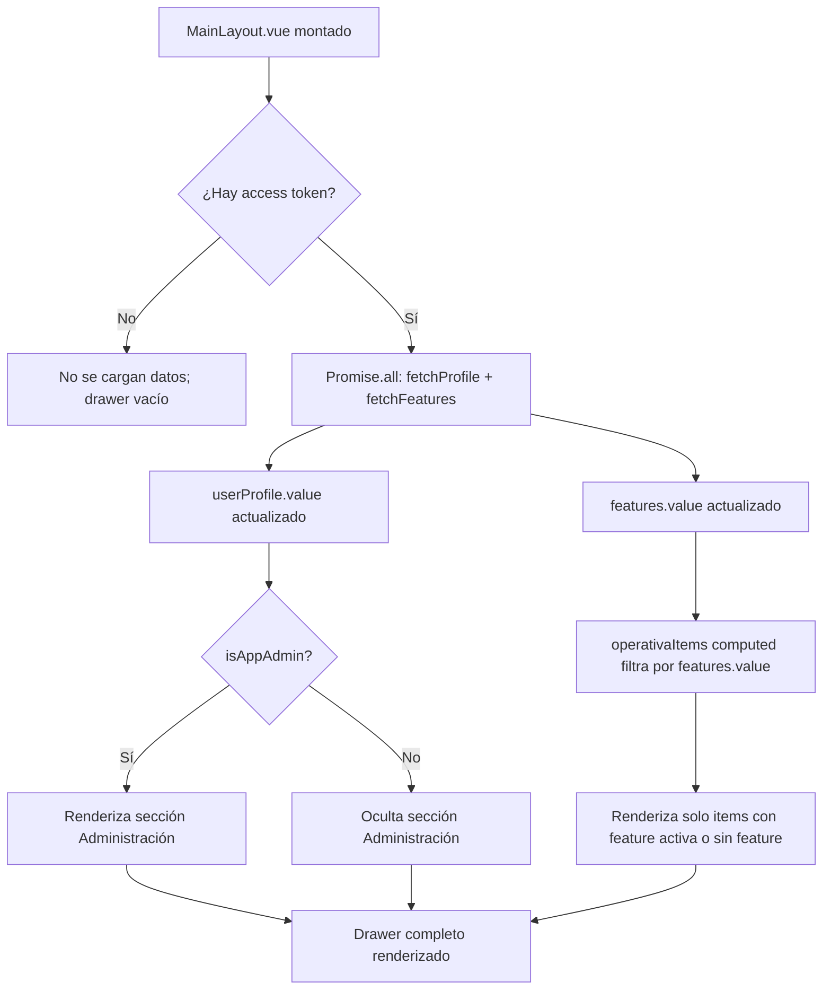

# Feature: Menú de Navegación con Secciones y Role Gating

## Descripción

El menú lateral de Hipica se organiza en tres secciones fijas con criterios de visibilidad independientes: **Administración**, **Operativa** y **Mi espacio**. La estructura del menú vive íntegramente en `MainLayout.vue` como constantes tipadas; ya no se lee de `branding.json`.

Esta es una evolución respecto a la versión anterior (ver [menu-lateral-dinamico.md](menu-lateral-dinamico.md)), que definía los items de navegación en el fichero de branding por cliente. El enfoque actual centraliza la estructura de navegación en el código y aplica dos capas de filtrado:

1. **Gating por rol** — la sección "Administración" solo es visible para `app_admin`.
2. **Gating por feature** — cada item de la sección "Operativa" puede estar condicionado a que la hípica tenga activa una feature concreta.

---

## Estructura de Secciones

| Sección | Visible para | Criterio de filtrado de items |
|---------|-------------|-------------------------------|
| Administración | Solo `app_admin` | Siempre todos sus items |
| Operativa | Todos los roles | Solo los items cuya `feature` esté activa en la hípica |
| Mi espacio | Todos los roles | Siempre todos sus items |

### Items por sección

**Administración** (solo `app_admin`):

| Item | Ruta | Icono |
|------|------|-------|
| Hípicas | `/stables` | `mdi-home-group` |
| Niveles | `/levels` | `mdi-stairs` |
| Features | `/features` | `mdi-toggle-switch` |

**Operativa** (filtrada por feature activa):

| Item | Ruta | Feature requerida |
|------|------|-------------------|
| Caballos | `/horses` | `HORSES` |
| Boxes | `/boxes` | `HORSES` |
| Clientes | `/clients` | `CLIENTS` |
| Clases | `/lessons` | `LESSONS` |

**Mi espacio** (siempre visible):

| Item | Ruta | Icono |
|------|------|-------|
| Mi perfil | `/profile` | `mdi-account-circle-outline` |

---

## Flujo de Renderizado



---

## Implementación Técnica

### Constantes de navegación en MainLayout.vue

Los items de cada sección se definen como constantes tipadas (`NavItem[]`) en el `<script setup>` del layout. No se leen de ficheros externos.

### Computed para la sección Operativa

La sección "Operativa" es la única filtrada reactivamente. El computed evalúa cada item comprobando si su campo `feature` está incluido en `features.value`:

```
OPERATIVA_ITEMS.filter(item => !item.feature || features.value.includes(item.feature))
```

Items sin campo `feature` pasan siempre. Items con `feature` solo pasan si esa feature está activa para la hípica del usuario.

### Control de la sección Administración

La sección entera se condiciona con `v-if="isAppAdmin"` en el template. `isAppAdmin` es un `computed` exportado desde `src/auth/profile.ts` que evalúa `userProfile.value?.role === "app_admin"`.

### Carga en `onMounted`

Al montar el layout se ejecutan en paralelo `fetchProfile()` y `fetchFeatures()`. Ambas persisten su resultado en `localStorage`, de modo que en recargas posteriores el menú se muestra inmediatamente desde caché y se actualiza en segundo plano.

---

## Tipos involucrados

Definidos en `src/types/api.ts`:

| Tipo | Uso |
|------|-----|
| `NavItem` | Item de navegación con `titleKey`, `icon`, `route` y `feature` opcional |
| `NavSection` | Agrupación de items con `titleKey` y flag `adminOnly` |
| `FeatureCode` | Union literal de los códigos de feature válidos |

---

## Componentes y archivos involucrados

| Archivo | Responsabilidad |
|---------|----------------|
| `src/layouts/MainLayout.vue` | Define las constantes de navegación, aplica los filtros y renderiza el drawer |
| `src/auth/profile.ts` | Exporta `isAppAdmin` y `canManage` como computeds reactivos |
| `src/features/features.ts` | Estado global reactivo de features activas; persiste en localStorage |
| `src/types/api.ts` | Tipos `NavItem`, `NavSection` y `FeatureCode` |

---

## Diferencias respecto a la versión anterior

| Aspecto | Version anterior | Version actual |
|---------|-----------------|----------------|
| Origen de los items | `branding.json` por cliente | Constantes en `MainLayout.vue` |
| Filtrado de items | `filterNavigation()` en `filter.ts` | `computed` inline en el layout |
| Secciones | Una sola lista plana | Tres secciones con subencabezados |
| Gating por rol | No existía | Sección "Administración" solo para `app_admin` |
| Gating por feature | En todos los items si tenían campo `feature` | Solo en la sección "Operativa" |

El fichero `branding.json` mantiene la configuración visual (nombre de la app, logo, paleta de colores) pero ya no contiene la definición de los items de navegación.

---

## Decisiones Técnicas

| Decisión | Justificación |
|----------|--------------|
| Navegación en código, no en JSON | La estructura del menú es la misma para todos los clientes; solo los módulos contratados varían. Centralizar en código evita desincronizaciones entre ficheros de branding y el router |
| Tres secciones fijas | Mejora la orientación del usuario separando administración global, operativa diaria y espacio personal |
| `isAppAdmin` como computed en profile.ts | Reutilizable en cualquier vista que necesite ocultar funcionalidad de administración; evita comparaciones de string dispersas por el código |
| Carga paralela de profile y features | Minimiza el tiempo de espera antes de que el menú esté completo |
