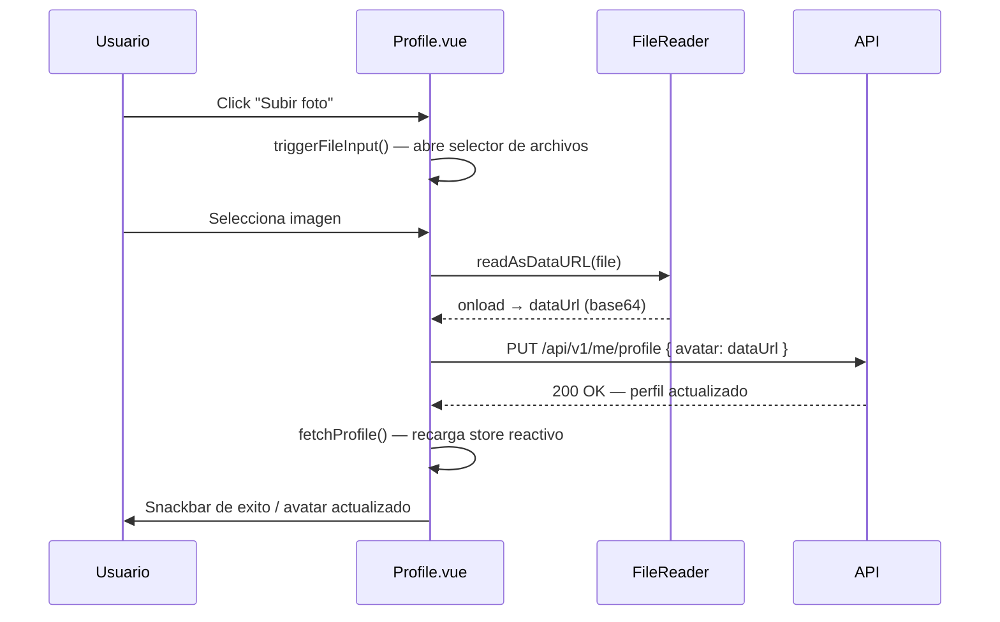

# Feature: Perfil de Usuario con Avatar

## Descripcion

La pantalla de perfil permite al usuario autenticado ver su nombre y datos de cuenta, subir una foto de perfil (avatar) y editar su email. El avatar se almacena como data URL en base64 directamente en la tabla `user`, sin necesidad de un servicio de almacenamiento externo.

## Modelo de Datos

### Columna nueva en `User`

| Columna | Tipo | Default | Descripcion |
|---------|------|---------|-------------|
| `avatar` | `VARCHAR` (nullable) | `null` | Data URL en base64 (formato `data:image/...;base64,...`) o URL externa |

## Endpoints Afectados

### `GET /api/v1/me/profile` — campos en la respuesta

| Campo | Tipo | Descripcion |
|-------|------|-------------|
| `id` | `int` | ID del usuario |
| `name` | `str` | Nombre del usuario |
| `email` | `str` | Email del usuario |
| `role` | `str` | Rol del usuario |
| `stable_id` | `int \| null` | ID de la hipica |
| `stable_name` | `str \| null` | Nombre legible de la hipica |
| `stable_theme` | `str` | Tema de branding (default: `"default"`) |
| `avatar` | `str \| null` | Data URL del avatar o `null` si no se ha subido |

### `PUT /api/v1/me/profile` — endpoint nuevo

Permite al usuario actualizar su email y/o avatar. Ambos campos son opcionales; se actualiza unicamente lo que se incluye en el body.

**Request Body:**
```json
{
  "email": "nuevo@ejemplo.com",
  "avatar": "data:image/png;base64,iVBORw0KGgo..."
}
```

**Validaciones:**
- Si se envia `email`, se comprueba que no este ya en uso por otro usuario (error 409 con `detail: "email.taken"`).
- Si se envia `avatar`, se almacena directamente sin validacion de formato ni limite de tamano a nivel de API.

**Response 200:** misma estructura que `GET /me/profile` con los datos actualizados.

## Flujo de Subida de Avatar en el Frontend



## Componentes Frontend

- **`src/views/Profile.vue`** — muestra el avatar en un `v-avatar` de 96px. Si no hay avatar muestra un icono por defecto. Incluye dialogo para editar email y logica de subida de fichero.
- **`src/auth/profile.ts`** — store reactivo `userProfile` que incluye el campo `avatar`. Se recarga con `fetchProfile()` tras cualquier actualizacion.
- **`src/types/api.ts`** — interfaz `UserProfile` actualizada con `avatar`, `stable_name` y `stable_theme`.

## Persistencia del avatar en localStorage

El avatar **no** se guarda en `localStorage` para evitar `QuotaExceededError` con imagenes grandes. `profile.ts` excluye el campo `avatar` al serializar:

```typescript
const { avatar: _avatar, ...rest } = data;
localStorage.setItem(STORAGE_KEY, JSON.stringify(rest));
```

El avatar se recupera desde la API en cada sesion via `fetchProfile()`, que `MainLayout.vue` llama en `onMounted`.

## Consideraciones

- Los avatares en base64 pueden ser de tamano considerable (varios cientos de KB para imagenes sin comprimir). Se recomienda compresion en cliente (p.ej. canvas resize a 200x200) antes de enviar.
- El campo `avatar` se devuelve en cada llamada a `GET /me/profile`. Valorar separar en un endpoint dedicado si el impacto en rendimiento es relevante.
- No se realiza ningun procesado de imagen en el backend (redimensionado, conversion de formato).
- El nombre del usuario (`name`) es de solo lectura desde el perfil; solo puede cambiarse desde la gestion de usuarios.
