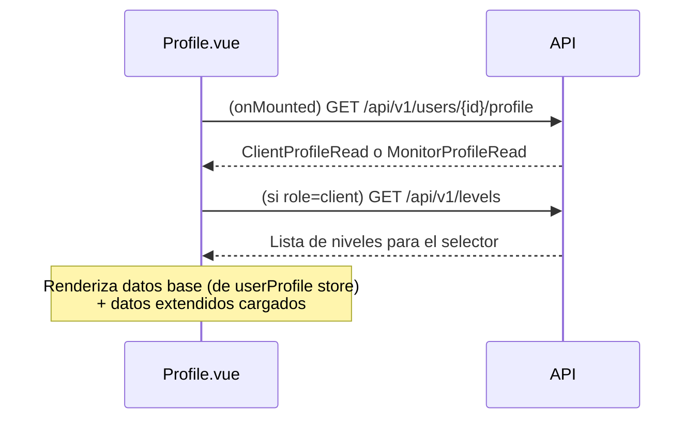

# Feature: Perfil de Usuario

## Descripcion

El perfil de usuario expone todos los datos del usuario autenticado y permite editarlos desde la vista `Profile.vue`. Ademas del perfil base (nombre, apellidos, DNI, email, telefono, rol e hipica), se muestran y editan los datos del perfil extendido segun el rol: `ClientProfile` para alumnos y `MonitorProfile` para monitores y ayudantes.

El store de perfil (`src/auth/profile.ts`) exporta dos computeds usados globalmente para control de acceso: `canManage` e `isAppAdmin`.

---

## Endpoints

### GET /api/v1/me/profile

Devuelve el perfil basico del usuario autenticado.

**Autenticacion requerida:** Si.

**Response 200:**
```json
{
  "id": 3,
  "name": "Juan",
  "apellidos": "Garcia",
  "email": "juan@hipica.com",
  "dni": "12345678A",
  "phone": "600100200",
  "role": "monitor",
  "stable_id": 1,
  "stable_name": "Hipica Can Valls",
  "stable_theme": "default",
  "avatar": null
}
```

### PUT /api/v1/me/profile

Actualiza los campos basicos del usuario autenticado.

**Payload:** `{ name?, apellidos?, email?, dni?, phone?, avatar? }` (todos opcionales)

**Notas:**
- Si se envia `email`, se verifica que no este en uso por otro usuario (HTTP 409 si esta duplicado).
- Si se envia `avatar`, debe ser un data URL en base64.

### GET /api/v1/users/{id}/profile

Obtiene el perfil extendido de un usuario (`ClientProfile` o `MonitorProfile` segun rol).

**Permisos:** El propio usuario puede consultar su perfil. Los administradores pueden ver perfiles de cualquier usuario de su hipica.

### PUT /api/v1/users/{id}/profile

Crea o actualiza (upsert) el perfil extendido de un usuario.

**Permisos:** El propio usuario puede editar su perfil extendido. Los administradores pueden editar perfiles de usuarios de su hipica.

---

## Store reactivo: src/auth/profile.ts

| Exportacion | Tipo | Descripcion |
|-------------|------|-------------|
| `userProfile` | `Ref<UserProfile \| null>` | Perfil completo del usuario; `null` si no hay sesion activa |
| `fetchProfile()` | `async function` | Llama a `GET /api/v1/me/profile`, actualiza `userProfile` y persiste en localStorage |
| `clearProfile()` | `function` | Limpia `userProfile` y elimina la entrada de localStorage (se llama en logout) |
| `canManage` | `ComputedRef<boolean>` | `true` si el rol es `stable_admin` o `app_admin` |
| `isAppAdmin` | `ComputedRef<boolean>` | `true` si el rol es `app_admin` |

El perfil se persiste en `localStorage` bajo la clave `hipica_user_profile` para que `canManage` e `isAppAdmin` tengan valores correctos al recargar antes de que se complete la llamada al backend.

---

## Vista: Profile.vue

La vista `/profile` muestra todos los datos del usuario autenticado y permite editarlos.

### Datos mostrados

**Seccion principal:**

| Campo | Fuente |
|-------|--------|
| Nombre | `userProfile.name` |
| Apellidos | `userProfile.apellidos` |
| Email | `userProfile.email` |
| DNI / NIF | `userProfile.dni` |
| Telefono | `userProfile.phone` |
| Rol | Traducido via `profile.roles.<role>` |
| Hipica | `userProfile.stable_name` |

**Seccion "Datos adicionales"** (visible si el rol tiene perfil extendido):

- `role=client` → campos de `ClientProfile`: direccion, IBAN, nivel, notas
- `role=monitor` o `role=assistant` → campos de `MonitorProfile`: especialidad, certificados, experiencia, disponibilidad, IBAN, tarifa/hora, notas internas

### Dialogo de edicion

El dialogo de edicion incluye todos los campos editables organizados en secciones:

1. **Campos basicos**: nombre, apellidos, email, DNI, telefono
2. **Perfil de alumno** (solo `role=client`): direccion, IBAN, nivel (selector), notas
3. **Perfil de monitor/ayudante** (solo `role=monitor` o `role=assistant`): especialidad, certificados, experiencia, disponibilidad, IBAN, tarifa/hora, notas internas

Al guardar se realizan hasta dos llamadas en secuencia:
1. `PUT /api/v1/me/profile` — campos basicos del usuario
2. `PUT /api/v1/users/{id}/profile` — perfil extendido (si el rol tiene uno)

### Flujo de carga



---

## Tipo involucrado

Definido en `src/types/api.ts`:

```typescript
export type UserProfile = {
  id: number;
  name: string;
  apellidos: string | null;
  email: string;
  dni: string | null;
  phone: string | null;
  role: string;
  stable_id: number | null;
  stable_name: string | null;
  stable_theme: string | null;
  avatar: string | null;
};
```

---

## Archivos involucrados

| Archivo | Responsabilidad |
|---------|----------------|
| `app/api/v1/endpoints/me.py` | Endpoints `GET/PUT /me/profile` |
| `app/api/v1/endpoints/user.py` | Endpoints `GET/PUT /users/{id}/profile` |
| `src/auth/profile.ts` | Store reactivo global del perfil |
| `src/views/Profile.vue` | Vista completa con lectura y edicion de todos los campos |
| `src/types/api.ts` | Tipos `UserProfile`, `ClientProfileData`, `MonitorProfileData` |

---

## Consideraciones

- `fetchProfile()` se llama en `MainLayout.vue`, no en `Profile.vue`. La vista consume el estado ya cargado del store y ademas carga el perfil extendido propio en su `onMounted`.
- `apellidos` en `User` es el apellido del usuario. `ClientProfile` ya no tiene campo `apellidos` propio — se lee directamente de `User.apellidos`.
- El campo `telefono` de `MonitorProfile` es independiente del `phone` de `User`: el primero es contacto profesional, el segundo es general.
