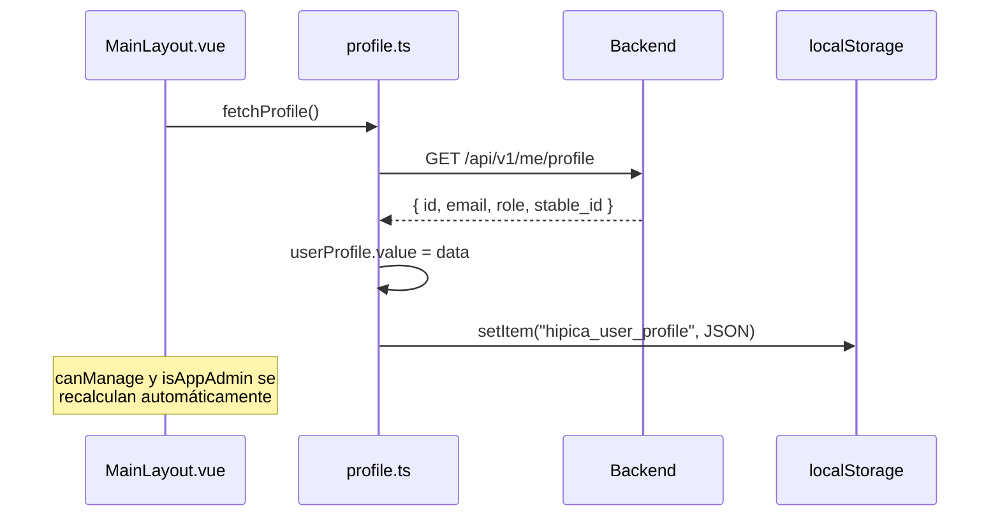

# Feature: Perfil de Usuario

## Descripción

El perfil de usuario expone los datos básicos del usuario autenticado (email, rol e hípica asignada) y los pone a disposición del frontend como estado reactivo global. Además de la vista informativa `Profile.vue`, el store del perfil exporta dos computeds que se usan a lo largo de toda la aplicación para aplicar gating de funcionalidades: `canManage` e `isAppAdmin`.

---

## Endpoint

### GET /api/v1/me/profile

Devuelve el perfil del usuario autenticado a partir del token JWT.

**Autenticación requerida:** Sí. Token Bearer en la cabecera `Authorization`.

**Rol requerido:** Cualquier usuario autenticado (no hay restricción de rol adicional).

**Response 200:**
```json
{
  "id": 3,
  "email": "monitor@hipica.com",
  "role": "monitor",
  "stable_id": 1
}
```

| Campo | Tipo | Descripción |
|-------|------|-------------|
| `id` | integer | ID del usuario en la base de datos |
| `email` | string | Correo electrónico del usuario |
| `role` | string | Rol asignado: `app_admin`, `stable_admin`, `monitor` o `client` |
| `stable_id` | integer o null | ID de la hípica a la que pertenece el usuario; `null` para `app_admin` global |

**Errores posibles:**

| Código | Causa |
|--------|-------|
| 401 | Token ausente, inválido o expirado |

---

## Store reactivo: src/auth/profile.ts

El módulo `profile.ts` centraliza el estado del perfil y sus derivados en un store ligero basado en `ref` y `computed` de Vue.

### Estado y funciones exportadas

| Exportación | Tipo | Descripción |
|-------------|------|-------------|
| `userProfile` | `Ref<UserProfile \| null>` | Perfil completo del usuario; `null` si no hay sesión activa |
| `fetchProfile()` | `async function` | Llama a `GET /api/v1/me/profile`, actualiza `userProfile` y persiste en localStorage |
| `clearProfile()` | `function` | Limpia `userProfile` y elimina la entrada de localStorage (se llama en logout) |
| `canManage` | `ComputedRef<boolean>` | `true` si el rol es `stable_admin` o `app_admin` |
| `isAppAdmin` | `ComputedRef<boolean>` | `true` si el rol es `app_admin` |

### Persistencia en localStorage

El perfil se serializa en `localStorage` bajo la clave `hipica_user_profile`. Esto permite que, al recargar la página, los computeds `canManage` e `isAppAdmin` tengan valores correctos de forma inmediata (antes de que se complete la llamada al backend).

| Clave localStorage | Contenido |
|-------------------|-----------|
| `hipica_user_profile` | Objeto `UserProfile` serializado como JSON |

### Flujo de carga



La carga se ejecuta en `onMounted` de `MainLayout.vue` en paralelo con `fetchFeatures()`:

```
onMounted → Promise.all([fetchFeatures(), fetchProfile()])
```

---

## Uso de canManage e isAppAdmin en vistas

Estos dos computeds se importan directamente en cualquier componente que necesite aplicar gating:

| Computed | Roles que devuelven true | Uso principal |
|----------|--------------------------|---------------|
| `canManage` | `stable_admin`, `app_admin` | Controla si se muestran botones de crear, editar y eliminar |
| `isAppAdmin` | `app_admin` | Controla si se muestra el selector de hípica en formularios y si se cargan listas de todas las hípicas |

Ejemplos de uso:

- `Boxes.vue` y `Horses.vue`: el botón "Añadir" del footer y el botón "Eliminar" del diálogo están condicionados a `canManage`.
- `Boxes.vue` y `Horses.vue`: el selector de hípica en el formulario está condicionado a `isAppAdmin`.
- `MainLayout.vue`: la sección "Administración" del menú está condicionada a `isAppAdmin`.

---

## Vista: Profile.vue

La vista `/profile` muestra el perfil del usuario autenticado en formato de tarjeta de solo lectura. Lee directamente del store reactivo `userProfile`; no realiza ninguna llamada adicional al backend.

Campos mostrados:

| Campo | Icono | Fuente |
|-------|-------|--------|
| Email | `mdi-email-outline` | `userProfile.email` |
| Rol | `mdi-shield-account-outline` | Traducido mediante clave i18n `profile.roles.<role>` |
| Hípica | `mdi-home-outline` | `userProfile.stable_id` (solo si no es null) |

El rol se traduce usando la clave `profile.roles.{role}` del sistema i18n. Si no existe traducción para el rol, se muestra el valor bruto.

---

## Tipo involucrado

Definido en `src/types/api.ts`:

```typescript
export type UserProfile = {
  id: number;
  email: string;
  role: string;
  stable_id: number | null;
};
```

---

## Archivos involucrados

| Archivo | Responsabilidad |
|---------|----------------|
| `app/api/v1/endpoints/me.py` | Endpoint `GET /me/profile` |
| `src/auth/profile.ts` | Store reactivo: `userProfile`, `fetchProfile`, `clearProfile`, `canManage`, `isAppAdmin` |
| `src/views/Profile.vue` | Vista de solo lectura del perfil del usuario |
| `src/layouts/MainLayout.vue` | Llama a `fetchProfile()` al montar; usa `isAppAdmin` para el gating del menú |
| `src/types/api.ts` | Tipo `UserProfile` |

---

## Consideraciones

- `fetchProfile()` se llama en el layout y no en la vista `Profile.vue`. La vista solo consume el estado ya cargado. Esto evita llamadas duplicadas y hace que el perfil esté disponible globalmente desde el momento en que se monta el layout.
- Si el token expira y el interceptor de Axios no puede renovarlo, `fetchProfile()` lanzará un error capturado en el `catch` del `onMounted` del layout, sin bloquear el resto de la aplicación.
- `clearProfile()` debe llamarse siempre en el logout junto a `clearTokens()` para evitar que un usuario distinto vea el perfil de la sesión anterior.
