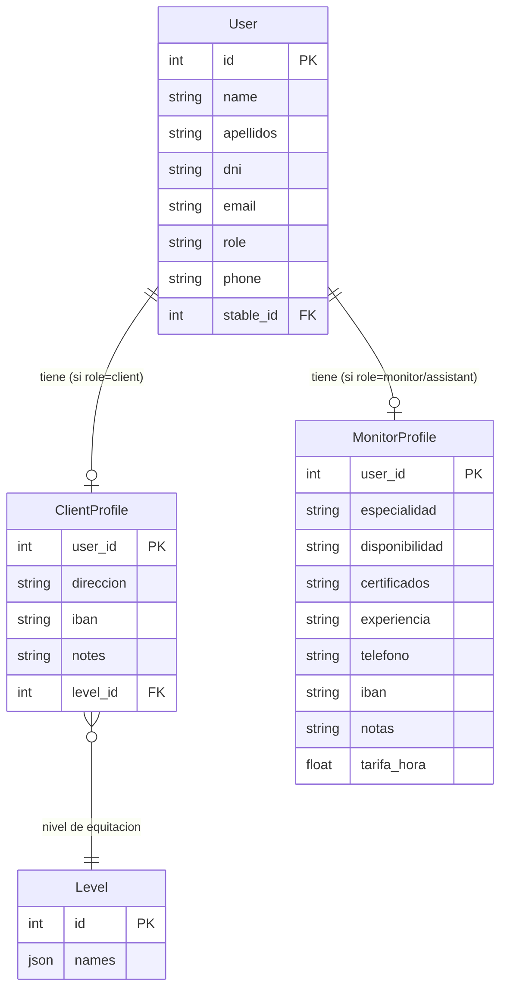

# Feature: Perfiles Extendidos (ClientProfile y MonitorProfile)

## Descripcion

Tablas de perfil extendido que almacenan datos adicionales de alumnos y monitores sin sobrecargar el modelo base `User`. Siguen una relacion 1:1 opcional con `User`, de modo que un usuario puede existir sin perfil extendido, y el perfil solo se crea cuando se necesita.

La gestion de estos perfiles esta disponible en dos lugares:
- **Vista Usuarios** (`Users.vue`): el administrador edita los perfiles extendidos de cualquier usuario de su hipica.
- **Vista Mi Perfil** (`Profile.vue`): el propio usuario puede ver y editar su perfil extendido.

## Motivacion

El modelo `User` contiene los campos minimos para autenticacion y operacion en la app (`name`, `apellidos`, `email`, `role`, `phone`, `stable_id`). Datos especificos de cada rol (IBAN del alumno, certificaciones del monitor, tarifa por hora) no pertenecen al usuario base y se separan en tablas propias para mantener el modelo limpio y extensible.

## ClientProfile

Perfil extendido para usuarios con `role="client"`.

**Tabla:** `clientprofile`

| Campo | Tipo | Descripcion |
|-------|------|-------------|
| `user_id` | `int` (PK, FK → `user.id`) | Clave primaria y referencia al usuario |
| `direccion` | `str \| null` | Direccion postal |
| `iban` | `str \| null` | IBAN para domiciliacion de pagos |
| `notes` | `str \| null` | Notas internas del administrador |
| `level_id` | `int \| null` (FK → `level.id`) | Nivel de equitacion del alumno |

> **Nota:** El campo `apellidos` del alumno reside en `User.apellidos`, no en `ClientProfile`. Esta columna fue eliminada de `clientprofile` en la migracion `0b4c25361aa2`.

**Archivo:** `app/models/client_profile.py`

**Campos en el formulario frontend:**
- Direccion (texto libre)
- IBAN
- Nivel de equitacion (selector desplegable con los niveles de la hipica)
- Notas (textarea)

**Relacion ORM:**

```python
# En User
client_profile: Optional["ClientProfile"] = Relationship(back_populates="user")

# En ClientProfile
user: Optional["User"] = Relationship(back_populates="client_profile")
```

## MonitorProfile

Perfil extendido para usuarios con `role="monitor"` o `role="assistant"`.

**Tabla:** `monitorprofile`

| Campo | Tipo | Descripcion |
|-------|------|-------------|
| `user_id` | `int` (PK, FK → `user.id`) | Clave primaria y referencia al usuario |
| `especialidad` | `str \| null` | Especialidad o disciplina ecuestre |
| `disponibilidad` | `str \| null` | Horario semanal serializado como JSON (ver estructura abajo) |
| `certificados` | `str \| null` | Certificaciones o titulos oficiales |
| `experiencia` | `str \| null` | Anos o descripcion de experiencia |
| `telefono` | `str \| null` | Telefono de contacto profesional |
| `iban` | `str \| null` | IBAN para pago de nomina u honorarios |
| `notas` | `str \| null` | Notas internas del administrador |
| `tarifa_hora` | `float \| null` | Tarifa por hora en euros |

**Archivo:** `app/models/monitor_profile.py`

### Estructura del horario semanal (`disponibilidad`)

El campo `disponibilidad` almacena el horario del monitor como cadena JSON:

```json
[
  {
    "day": "monday",
    "slots": [
      { "from": "10:00", "to": "13:00" },
      { "from": "16:00", "to": "19:00" }
    ]
  }
]
```

- `day` es uno de: `monday`, `tuesday`, `wednesday`, `thursday`, `friday`, `saturday`, `sunday`.
- El frontend serializa con `JSON.stringify` antes de enviar y deserializa con `JSON.parse` al cargar.

## Endpoints

| Metodo | Ruta | Permisos | Descripcion |
|--------|------|----------|-------------|
| `GET` | `/api/v1/users/{id}/profile` | Propio usuario o admin de la hipica | Obtener perfil extendido |
| `PUT` | `/api/v1/users/{id}/profile` | Propio usuario o admin de la hipica | Crear o actualizar perfil extendido (upsert) |

**Archivo:** `app/api/v1/endpoints/user.py`, `app/schemas/profile.py`

### Comportamiento del GET /profile

- Si `role=client` → devuelve `ClientProfileRead` (o campos vacios si no existe aun).
- Si `role=monitor` o `role=assistant` → devuelve `MonitorProfileRead` (o campos vacios si no existe aun).
- Otros roles → `null`.

### Comportamiento del PUT /profile (upsert)

El endpoint recibe `UserProfileUpdate`. Internamente filtra los campos segun el rol:

- `role=client` → aplica `_CLIENT_FIELDS = {"direccion", "iban", "notes", "level_id"}`.
- `role=monitor` o `role=assistant` → aplica `_MONITOR_FIELDS = {"especialidad", "disponibilidad", "certificados", "experiencia", "telefono", "iban", "notas", "tarifa_hora"}`.
- Si el registro de perfil no existe, se crea en la misma operacion.

## Diagrama de Relaciones



## Modelos y schemas afectados

- `app/models/client_profile.py` — ORM `ClientProfile`
- `app/models/monitor_profile.py` — ORM `MonitorProfile`
- `app/schemas/profile.py` — `ClientProfileRead`, `MonitorProfileRead`, `UserProfileUpdate`
- `app/api/v1/endpoints/user.py` — endpoints GET/PUT profile
- `hipica-frontend/src/views/Users.vue` — edicion de perfiles por administradores
- `hipica-frontend/src/views/Profile.vue` — edicion del perfil propio
- `hipica-frontend/src/types/api.ts` — tipos `ClientProfileData`, `MonitorProfileData`

## Consideraciones de Diseno

- La relacion es **1:1 opcional**: el perfil solo existe si se ha creado explicitamente.
- Ambas tablas usan `user_id` como clave primaria, garantizando unicidad.
- `apellidos` vive en `User`, no en `ClientProfile`, ya que es un dato de identidad del usuario y no especifico del rol de alumno.
- El campo `telefono` en `MonitorProfile` es independiente del `phone` en `User`.
- El campo `iban` existe en ambas tablas con usos distintos: domiciliacion de pagos (cliente) vs. pago de honorarios (monitor).
- El rol `assistant` comparte exactamente el mismo perfil extendido que `monitor` (tabla `monitorprofile`).
