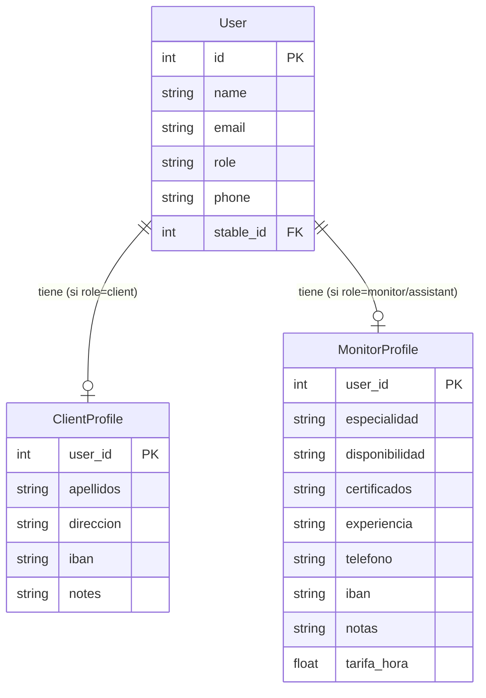

# Feature: Perfiles Extendidos (ClientProfile y MonitorProfile)

## Descripcion

Tablas de perfil extendido que almacenan datos adicionales de alumnos y monitores sin sobrecargar el modelo base `User`. Siguen una relacion 1:1 opcional con `User`, de modo que un usuario puede existir sin perfil extendido, y el perfil solo se crea cuando se necesita.

## Motivacion

El modelo `User` contiene los campos minimos para autenticacion y operacion en la app (`name`, `email`, `role`, `phone`, `stable_id`). Datos especificos de cada rol (IBAN del alumno, certificaciones del monitor, tarifa por hora) no pertenecen al usuario base y se separan en tablas propias para mantener el modelo limpio y extensible.

## Estado Actual

> Las tablas estan creadas en base de datos. Los endpoints de gestion de perfiles **no estan implementados todavia**.

## ClientProfile

Perfil extendido para usuarios con `role="client"`.

**Tabla:** `clientprofile`

| Campo | Tipo | Descripcion |
|-------|------|-------------|
| `user_id` | `int` (PK, FK → `user.id`) | Clave primaria y referencia al usuario |
| `apellidos` | `str \| null` | Apellidos del alumno |
| `direccion` | `str \| null` | Direccion postal |
| `iban` | `str \| null` | IBAN para domiciliacion de pagos |
| `notes` | `str \| null` | Notas internas del administrador |

**Archivo:** `app/models/client_profile.py`

**Relacion ORM:**

```python
# En User
client_profile: Optional["ClientProfile"] = Relationship(back_populates="user")

# En ClientProfile
user: Optional["User"] = Relationship(back_populates="client_profile")
```

## MonitorProfile

Perfil extendido para usuarios con `role="monitor"` o `role="assistant"`.

**Tabla:** `monitorprofile`

| Campo | Tipo | Descripcion |
|-------|------|-------------|
| `user_id` | `int` (PK, FK → `user.id`) | Clave primaria y referencia al usuario |
| `especialidad` | `str \| null` | Especialidad o disciplina ecuestre |
| `disponibilidad` | `str \| null` | Horario o disponibilidad habitual |
| `certificados` | `str \| null` | Certificaciones o titulos oficiales |
| `experiencia` | `str \| null` | Anos o descripcion de experiencia |
| `telefono` | `str \| null` | Telefono de contacto profesional |
| `iban` | `str \| null` | IBAN para pago de nomina u honorarios |
| `notas` | `str \| null` | Notas internas del administrador |
| `tarifa_hora` | `float \| null` | Tarifa por hora en euros |

**Archivo:** `app/models/monitor_profile.py`

**Relacion ORM:**

```python
# En User
monitor_profile: Optional["MonitorProfile"] = Relationship(back_populates="user")

# En MonitorProfile
user: Optional["User"] = Relationship(back_populates="monitor_profile")
```

## Diagrama de Relaciones



## Consideraciones de Diseno

- La relacion es **1:1 opcional**: el perfil solo existe si se ha creado explicitamente. Un `User(role="client")` puede existir sin `ClientProfile`.
- Ambas tablas usan `user_id` como clave primaria (PK coincide con FK), garantizando que no pueden existir dos perfiles para el mismo usuario.
- El campo `telefono` en `MonitorProfile` es independiente del `phone` en `User`. El `phone` en `User` es el telefono general/personal; `MonitorProfile.telefono` es el de contacto profesional.
- El campo `iban` existe en ambas tablas porque su uso es diferente: para alumnos es domiciliacion de pagos, para monitores es pago de honorarios.

## Proximos Pasos

Cuando se implementen los endpoints de perfiles, seguir las convenciones del proyecto:

- `GET /api/v1/users/{user_id}/profile` — obtener perfil extendido
- `PUT /api/v1/users/{user_id}/profile` — crear o actualizar perfil extendido
- Roles con acceso: `stable_admin` (propia cuadra) y `app_admin`
- Devolver siempre `response_model` con schema Pydantic separado del ORM
