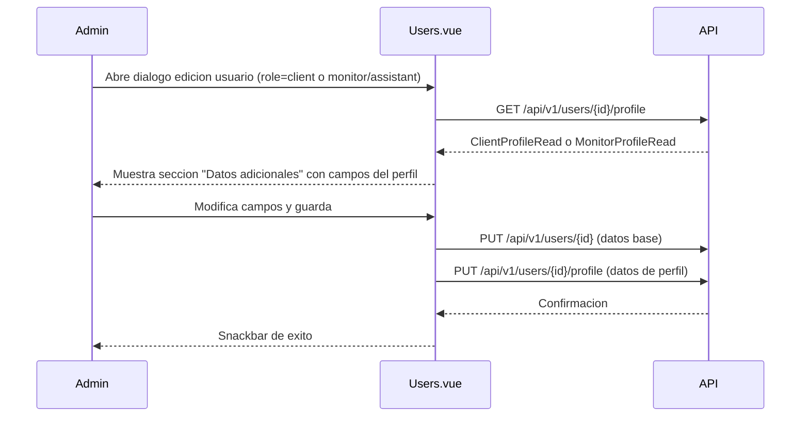
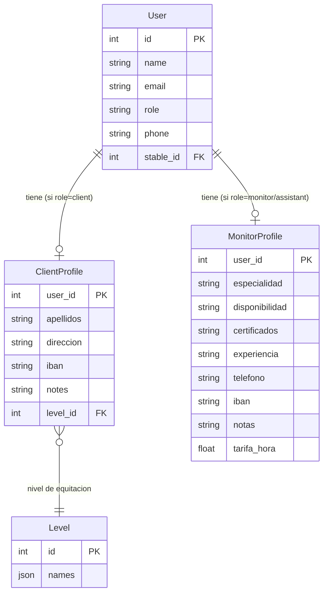

# Feature: Perfiles Extendidos (ClientProfile y MonitorProfile)

## Descripcion

Tablas de perfil extendido que almacenan datos adicionales de alumnos y monitores sin sobrecargar el modelo base `User`. Siguen una relacion 1:1 opcional con `User`, de modo que un usuario puede existir sin perfil extendido, y el perfil solo se crea cuando se necesita.

La gestion de estos perfiles esta integrada directamente en el dialogo de creacion/edicion de usuarios (`Users.vue`): al seleccionar un rol con perfil extendido, el formulario muestra una seccion "Datos adicionales" con los campos especificos del rol.

## Motivacion

El modelo `User` contiene los campos minimos para autenticacion y operacion en la app (`name`, `email`, `role`, `phone`, `stable_id`). Datos especificos de cada rol (IBAN del alumno, certificaciones del monitor, tarifa por hora) no pertenecen al usuario base y se separan en tablas propias para mantener el modelo limpio y extensible.

## ClientProfile

Perfil extendido para usuarios con `role="client"`.

**Tabla:** `clientprofile`

| Campo | Tipo | Descripcion |
|-------|------|-------------|
| `user_id` | `int` (PK, FK → `user.id`) | Clave primaria y referencia al usuario |
| `apellidos` | `str \| null` | Apellidos del alumno |
| `direccion` | `str \| null` | Direccion postal |
| `iban` | `str \| null` | IBAN para domiciliacion de pagos |
| `notes` | `str \| null` | Notas internas del administrador |
| `level_id` | `int \| null` (FK → `level.id`) | Nivel de equitacion del alumno |

**Archivo:** `app/models/client_profile.py`

**Campos en el formulario frontend:**
- Apellidos (texto libre)
- Direccion (texto libre)
- IBAN
- Nivel de equitacion (selector desplegable con los niveles de la hipica)
- Notas (textarea)

**Relacion ORM:**

```python
# En User
client_profile: Optional["ClientProfile"] = Relationship(back_populates="user")

# En ClientProfile
user: Optional["User"] = Relationship(back_populates="client_profile")
```

## MonitorProfile

Perfil extendido para usuarios con `role="monitor"` o `role="assistant"`.

**Tabla:** `monitorprofile`

| Campo | Tipo | Descripcion |
|-------|------|-------------|
| `user_id` | `int` (PK, FK → `user.id`) | Clave primaria y referencia al usuario |
| `especialidad` | `str \| null` | Especialidad o disciplina ecuestre |
| `disponibilidad` | `str \| null` | Horario semanal serializado como JSON (ver estructura abajo) |
| `certificados` | `str \| null` | Certificaciones o titulos oficiales |
| `experiencia` | `str \| null` | Anos o descripcion de experiencia |
| `telefono` | `str \| null` | Telefono de contacto profesional |
| `iban` | `str \| null` | IBAN para pago de nomina u honorarios |
| `notas` | `str \| null` | Notas internas del administrador |
| `tarifa_hora` | `float \| null` | Tarifa por hora en euros |

**Archivo:** `app/models/monitor_profile.py`

**Campos en el formulario frontend:**
- Especialidad
- Certificados
- Experiencia
- IBAN
- Tarifa/hora (numerico)
- Notas (textarea)
- Horario semanal (constructor visual, ver seccion siguiente)

### Estructura del horario semanal (`disponibilidad`)

El campo `disponibilidad` almacena el horario del monitor como cadena JSON. La estructura es:

```json
[
  {
    "day": "monday",
    "slots": [
      { "from": "10:00", "to": "13:00" },
      { "from": "16:00", "to": "19:00" }
    ]
  },
  {
    "day": "wednesday",
    "slots": [
      { "from": "09:00", "to": "14:00" }
    ]
  }
]
```

- `day` es uno de: `monday`, `tuesday`, `wednesday`, `thursday`, `friday`, `saturday`, `sunday`.
- Cada dia puede tener multiples `slots` (franjas horarias).
- El frontend serializa este array con `JSON.stringify` antes de enviarlo y lo deserializa con `JSON.parse` al cargar el perfil.

**Relacion ORM:**

```python
# En User
monitor_profile: Optional["MonitorProfile"] = Relationship(back_populates="user")

# En MonitorProfile
user: Optional["User"] = Relationship(back_populates="monitor_profile")
```

## Endpoints

| Metodo | Ruta | Roles | Descripcion |
|--------|------|-------|-------------|
| `GET` | `/api/v1/users/{id}/profile` | `stable_admin`, `app_admin` | Obtener perfil extendido del usuario |
| `PUT` | `/api/v1/users/{id}/profile` | `stable_admin`, `app_admin` | Crear o actualizar perfil extendido (upsert) |
| `PUT` | `/api/v1/users/{id}/password` | `app_admin` | Cambiar contrasena de cualquier usuario |

**Archivos:** `app/api/v1/endpoints/user.py`, `app/schemas/profile.py`

### Comportamiento del GET /profile

- Si `role=client` → devuelve `ClientProfileRead` (o campos vacios si no existe aun).
- Si `role=monitor` o `role=assistant` → devuelve `MonitorProfileRead` (o campos vacios si no existe aun).
- Otros roles → `null`.
- `stable_admin` solo puede consultar perfiles de usuarios de su propia cuadra.

### Comportamiento del PUT /profile (upsert)

El endpoint recibe `UserProfileUpdate`, un payload unificado con todos los campos de ambos perfiles. Internamente filtra los campos segun el rol del usuario:

- `role=client` → solo aplica `_CLIENT_FIELDS = {"apellidos", "direccion", "iban", "notes", "level_id"}`.
- `role=monitor` o `role=assistant` → solo aplica `_MONITOR_FIELDS = {"especialidad", "disponibilidad", "certificados", "experiencia", "telefono", "iban", "notas", "tarifa_hora"}`.
- Si el registro de perfil no existe, se crea en la misma operacion.
- Roles sin perfil extendido devuelven HTTP 400.

### Cambio de contrasena

`PUT /api/v1/users/{id}/password` acepta `{ "password": "nueva_contrasena" }`. Solo accesible para `app_admin`. En el frontend, el boton "Cambiar contrasena" aparece unicamente al editar un usuario existente y solo si `isAppAdmin`.

## Flujo Frontend (Users.vue)



**Nota sobre el horario del monitor:** al guardar, el frontend construye el payload del perfil concatenando los campos de `monitorProfile` con `disponibilidad: JSON.stringify(schedule)`. Al cargar, extrae el campo `disponibilidad` del objeto recibido y lo parsea con `JSON.parse` para reconstruir el array de dias/franjas.

## Diagrama de Relaciones



## Modelos y schemas afectados

- `app/models/client_profile.py` — ORM `ClientProfile`
- `app/models/monitor_profile.py` — ORM `MonitorProfile`
- `app/schemas/profile.py` — `ClientProfileRead`, `MonitorProfileRead`, `UserProfileUpdate`
- `app/api/v1/endpoints/user.py` — endpoints GET/PUT profile y PUT password
- `hipica-frontend/src/views/Users.vue` — integracion en el dialogo de usuario
- `hipica-frontend/src/types/api.ts` — tipos `ClientProfile`, `MonitorProfile`

## Consideraciones de Diseno

- La relacion es **1:1 opcional**: el perfil solo existe si se ha creado explicitamente. Un `User(role="client")` puede existir sin `ClientProfile`.
- Ambas tablas usan `user_id` como clave primaria (PK coincide con FK), garantizando que no pueden existir dos perfiles para el mismo usuario.
- El campo `telefono` en `MonitorProfile` es independiente del `phone` en `User`. El `phone` en `User` es el telefono general/personal; `MonitorProfile.telefono` es el de contacto profesional.
- El campo `iban` existe en ambas tablas porque su uso es diferente: para alumnos es domiciliacion de pagos, para monitores es pago de honorarios.
- El rol `assistant` comparte exactamente el mismo perfil extendido que `monitor` (tabla `monitorprofile`). Ver `docs/adr/ADR-002-rol-assistant.md` para la decision arquitectonica.
- El campo `level_id` en `ClientProfile` referencia la tabla `level` de la hipica, lo que permite filtrar o agrupar alumnos por nivel en informes futuros.
