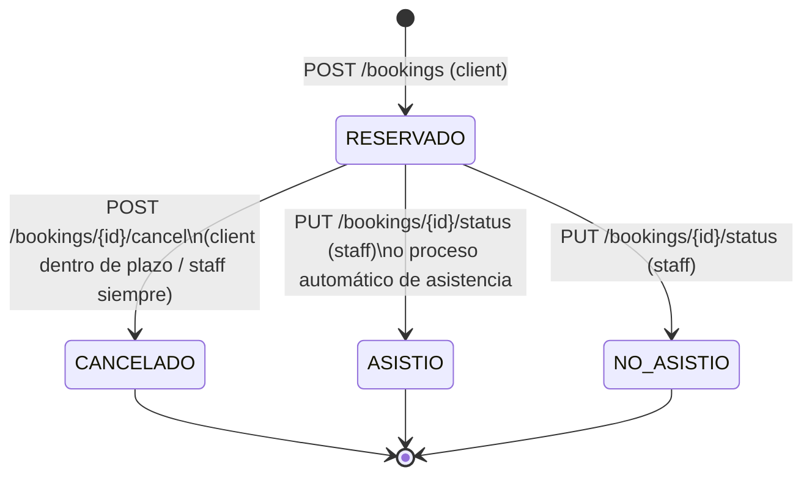
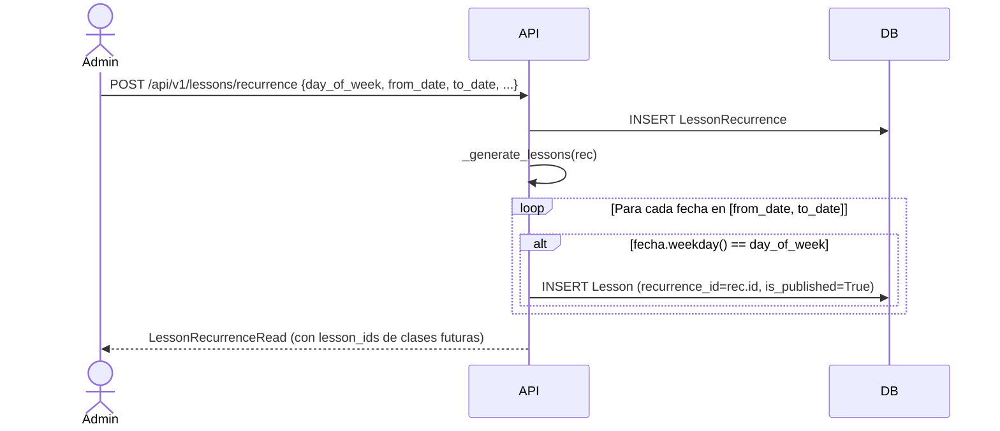
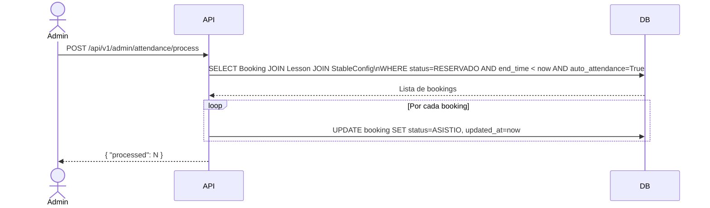
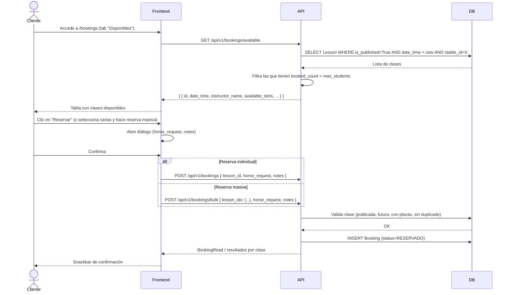
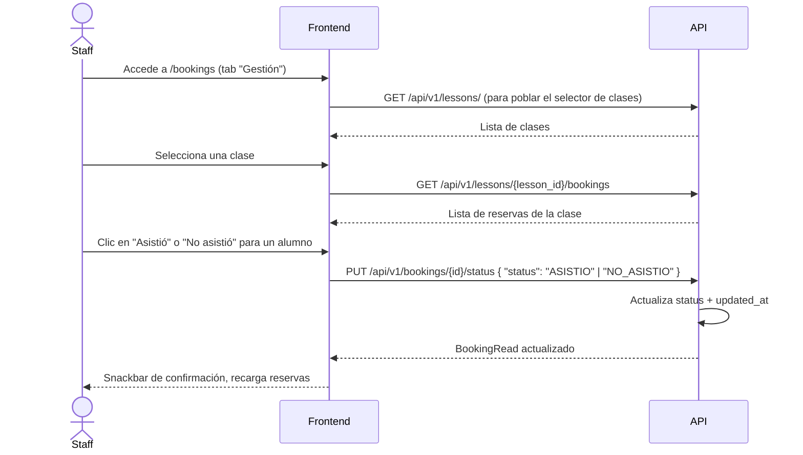

# Feature: Reservas (Bookings)

## Descripción

El módulo de reservas permite a los alumnos (rol `client`) inscribirse en clases publicadas, gestionar sus propias reservas y cancelarlas dentro del plazo configurado. El staff puede ver los inscritos por clase, modificar el estado de cualquier reserva y ejecutar el proceso de asistencia automática.

La feature introduce cuatro conceptos nuevos en el sistema:

- **Booking**: reserva individual de un alumno a una clase concreta.
- **LessonRecurrence**: plantilla de clase recurrente que genera automáticamente instancias de `Lesson`.
- **MonitorAvailability**: franjas horarias de disponibilidad de cada monitor (recurrente o puntual).
- **StableConfig**: configuración operativa de la hípica (plazo de cancelación, asistencia automática).

Adicionalmente se añaden dos campos a `Lesson`: `max_students` (aforo máximo) e `is_published` (visibilidad para reservas).

---

## Modelo de datos

### Diagrama de relaciones

```mermaid
erDiagram
    Stable ||--o{ Booking : "stable_id"
    Stable ||--o{ LessonRecurrence : "stable_id"
    Stable ||--o{ MonitorAvailability : "stable_id"
    Stable ||--|| StableConfig : "stable_id"

    Lesson ||--o{ Booking : "lesson_id"
    User ||--o{ Booking : "user_id"
    LessonRecurrence ||--o{ Lesson : "recurrence_id"
    User ||--o{ MonitorAvailability : "user_id"
    User ||--o{ LessonRecurrence : "instructor_id"

    Booking {
        int id PK
        int stable_id FK
        int lesson_id FK
        int user_id FK
        BookingStatus status
        string horse_request
        string notes
        datetime created_at
        datetime cancelled_at
        datetime updated_at
    }

    LessonRecurrence {
        int id PK
        int stable_id FK
        int instructor_id FK
        int helper_id FK
        int track_id FK
        int day_of_week
        time start_time
        time end_time
        date from_date
        date to_date
        int max_students
        string description
        datetime created_at
    }

    MonitorAvailability {
        int id PK
        int stable_id FK
        int user_id FK
        bool is_recurring
        int day_of_week
        date specific_date
        time start_time
        time end_time
        bool is_active
    }

    StableConfig {
        int stable_id PK_FK
        int cancel_deadline_hours
        bool auto_attendance
    }
```

### Entidades nuevas

#### Booking

Registra la inscripción de un alumno a una clase concreta.

| Campo | Tipo | Descripción |
|---|---|---|
| `id` | int | Clave primaria |
| `stable_id` | int FK | Hípica a la que pertenece (multi-tenant) |
| `lesson_id` | int FK | Clase reservada |
| `user_id` | int FK | Alumno que reserva |
| `status` | enum | Estado actual de la reserva (ver sección de estados) |
| `horse_request` | string? | Preferencia de caballo expresada por el alumno |
| `notes` | string? | Notas adicionales del alumno |
| `created_at` | datetime | Momento de creación |
| `cancelled_at` | datetime? | Momento en que se canceló |
| `updated_at` | datetime? | Última modificación de estado |

Restriccion de unicidad: `(lesson_id, user_id)` — un alumno no puede tener dos reservas activas a la misma clase.

#### LessonRecurrence

Plantilla que define una clase que se repite semanalmente dentro de un rango de fechas. Al crearse, genera automáticamente todas las instancias de `Lesson` correspondientes.

| Campo | Tipo | Descripción |
|---|---|---|
| `id` | int | Clave primaria |
| `stable_id` | int FK | Hípica |
| `instructor_id` | int FK | Monitor principal |
| `helper_id` | int? FK | Ayudante opcional |
| `track_id` | int? FK | Pista opcional |
| `day_of_week` | int | Día de la semana (0=lunes, 6=domingo) |
| `start_time` | time | Hora de inicio |
| `end_time` | time? | Hora de fin |
| `from_date` | date | Fecha de inicio del rango |
| `to_date` | date | Fecha de fin del rango |
| `max_students` | int? | Aforo máximo por clase generada |
| `description` | string? | Descripción común a todas las instancias |
| `created_at` | datetime | Momento de creación |

#### MonitorAvailability

Franja de disponibilidad de un monitor. Puede ser recurrente (por día de la semana) o puntual (fecha concreta).

| Campo | Tipo | Descripción |
|---|---|---|
| `id` | int | Clave primaria |
| `stable_id` | int FK | Hípica |
| `user_id` | int FK | Monitor o ayudante |
| `is_recurring` | bool | `true` = recurrente semanal, `false` = fecha específica |
| `day_of_week` | int? | Día de la semana (solo si `is_recurring=true`) |
| `specific_date` | date? | Fecha concreta (solo si `is_recurring=false`) |
| `start_time` | time | Inicio de la franja |
| `end_time` | time | Fin de la franja |
| `is_active` | bool | Permite desactivar sin eliminar |

#### StableConfig

Configuración operativa de la hípica. Se crea automáticamente con valores por defecto la primera vez que se necesita.

| Campo | Tipo | Por defecto | Descripción |
|---|---|---|---|
| `stable_id` | int PK/FK | — | Clave primaria y clave foránea a `Stable` |
| `cancel_deadline_hours` | int | 24 | Horas mínimas antes de la clase para cancelar |
| `auto_attendance` | bool | `false` | Si `true`, las reservas pendientes de clases ya finalizadas se marcan automáticamente como ASISTIO |

### Campos añadidos a Lesson

| Campo | Tipo | Por defecto | Descripción |
|---|---|---|---|
| `max_students` | int? | `null` | Aforo máximo. `null` = sin límite |
| `is_published` | bool | `false` | Si `false`, la clase no aparece en el listado de reservas |
| `recurrence_id` | int? FK | `null` | Enlace a la `LessonRecurrence` que generó esta clase |

---

## Estados de una reserva



| Transición | Quién puede ejecutarla | Restricciones |
|---|---|---|
| `[*] → RESERVADO` | `client` | Clase publicada, en el futuro, con plazas disponibles y sin reserva activa previa |
| `RESERVADO → CANCELADO` | `client` o cualquier staff | El cliente solo puede cancelar si faltan más horas que `cancel_deadline_hours`; el staff puede cancelar en cualquier momento |
| `RESERVADO → ASISTIO` | staff o proceso automático | La clase debe haber terminado (para el proceso automático); el staff puede marcarlo en cualquier momento |
| `RESERVADO → NO_ASISTIO` | staff | Sin restricción de tiempo |

Una vez que la reserva llega a `CANCELADO`, `ASISTIO` o `NO_ASISTIO`, no se puede retransicionar mediante el endpoint de cancelación. El endpoint de actualización de estado (`PUT /bookings/{id}/status`) permite a staff asignar cualquier estado sin restricciones adicionales.

---

## Reglas de negocio

| Regla | Implementación |
|---|---|
| Solo clases publicadas son reservables | `Booking.create` verifica `lesson.is_published == True` |
| Solo clases futuras son reservables | `Booking.create` verifica `lesson.date_time > now` |
| Un alumno no puede tener dos reservas activas para la misma clase | Constraint único `(lesson_id, user_id)` + comprobación explícita en `create_booking` → HTTP 409 |
| Respeto de aforo máximo | Si `max_students` no es `null`, se cuenta el número de reservas en estado `RESERVADO`; si `>= max_students` → HTTP 409 |
| Cancelación con plazo mínimo (clientes) | Se consulta `StableConfig.cancel_deadline_hours`; si `(lesson.date_time - now) < deadline_hours * 3600s` → HTTP 400 |
| El staff puede cancelar sin restricción de tiempo | En `cancel_booking` se omite la comprobación de plazo si `current_user.role in STAFF_ROLES` |
| Multi-tenant estricto | Todos los endpoints filtran por `stable_id == current_user.stable_id` |
| La config de hípica se crea por defecto si no existe | `_get_config` y `_get_or_create_config` crean el registro con valores por defecto |
| Solo se procesan clases de hípicas con `auto_attendance=True` | El query de `process_attendance` incluye el join con `StableConfig` y filtra por `auto_attendance == True` |
| Las clases de una recurrencia se generan como `is_published=True` | `_generate_lessons` establece `is_published=True` en cada instancia generada |
| Propagación de cambios en recurrencia sobre clases con reservas requiere confirmación explícita | `PUT /lessons/recurrence/{id}` con `propagate=True` retorna HTTP 409 con detalle de clases afectadas si hay reservas activas y no se pasa `force=true` como query param |
| Al eliminar una recurrencia con reservas activas se requiere `force=true` | `DELETE /lessons/recurrence/{id}` protege igual que el PUT |

---

## Endpoints

### Bookings

| Método | Ruta | Roles | Descripción |
|---|---|---|---|
| `GET` | `/api/v1/bookings/available` | todos los roles | Lista clases publicadas, futuras y con plazas libres de la hípica del usuario autenticado |
| `POST` | `/api/v1/bookings` | `client` | Crea una reserva para el usuario autenticado |
| `POST` | `/api/v1/bookings/bulk` | `client` | Crea reservas en lote para múltiples clases; devuelve resultado por clase |
| `POST` | `/api/v1/bookings/{id}/cancel` | todos (con restricciones) | Cancela una reserva; el cliente solo puede cancelar la suya y dentro del plazo |
| `GET` | `/api/v1/bookings/mine` | `client` | Lista todas las reservas del alumno autenticado |
| `GET` | `/api/v1/lessons/{lesson_id}/bookings` | staff | Lista todas las reservas de una clase concreta |
| `PUT` | `/api/v1/bookings/{id}/status` | staff | Actualiza el estado de una reserva a cualquier valor |
| `POST` | `/api/v1/admin/attendance/process` | `stable_admin`, `app_admin` | Procesa asistencia automática para todas las clases finalizadas con `auto_attendance=True` |

### Disponibilidad de monitores

| Método | Ruta | Roles | Descripción |
|---|---|---|---|
| `GET` | `/api/v1/monitor-availability` | staff | Lista disponibilidades; monitores y ayudantes ven solo la suya propia |
| `POST` | `/api/v1/monitor-availability` | staff | Crea una franja de disponibilidad; monitores/ayudantes siempre la crean para sí mismos |
| `PUT` | `/api/v1/monitor-availability/{id}` | staff | Actualiza una franja; monitores/ayudantes solo pueden editar la suya |
| `DELETE` | `/api/v1/monitor-availability/{id}` | staff | Elimina una franja; monitores/ayudantes solo pueden eliminar la suya |

### Clases recurrentes

| Método | Ruta | Roles | Descripción |
|---|---|---|---|
| `POST` | `/api/v1/lessons/recurrence` | `stable_admin`, `app_admin` | Crea una recurrencia y genera todas las clases del rango |
| `GET` | `/api/v1/lessons/recurrence/{id}` | `stable_admin`, `app_admin` | Obtiene el detalle de una recurrencia con los IDs de clases futuras |
| `PUT` | `/api/v1/lessons/recurrence/{id}` | `stable_admin`, `app_admin` | Edita una recurrencia (ver lógica de propagación) |
| `DELETE` | `/api/v1/lessons/recurrence/{id}` | `stable_admin`, `app_admin` | Elimina la vinculación de clases futuras con la recurrencia |

### Configuración de hípica

| Método | Ruta | Roles | Descripción |
|---|---|---|---|
| `GET` | `/api/v1/stable-config` | `stable_admin`, `app_admin` | Obtiene la configuración de la hípica (crea con valores por defecto si no existe) |
| `PUT` | `/api/v1/stable-config` | `stable_admin`, `app_admin` | Actualiza la configuración |

---

## Disponibilidad de monitores

El modelo `MonitorAvailability` permite expresar cuándo está disponible un monitor con dos modalidades mutuamente excluyentes:

**Recurrente (`is_recurring=true`):** el monitor está disponible cada semana el mismo día. Se indica el `day_of_week` (0=lunes ... 6=domingo) y el rango horario. No se informa `specific_date`.

**Puntual (`is_recurring=false`):** el monitor está disponible solo en una fecha concreta. Se informa `specific_date` y el rango horario. No se informa `day_of_week`.

Las franjas tienen un flag `is_active` que permite desactivarlas temporalmente sin eliminarlas (útil para vacaciones o bajas puntuales).

**Control de visibilidad por rol:**
- `stable_admin` y `app_admin` ven las disponibilidades de todos los monitores de la hípica.
- `monitor` y `assistant` solo ven y gestionan las suyas propias. Si intentan crear una disponibilidad para otro usuario, el backend ignora el `user_id` enviado y lo sustituye por el del usuario autenticado.

---

## Clases recurrentes (LessonRecurrence)

### Flujo de creación



La función `_generate_lessons` itera día a día desde `from_date` hasta `to_date` (ambos inclusive) y crea una `Lesson` por cada fecha cuyo día de la semana coincida con `day_of_week`. Todas las clases generadas se crean con `is_published=True`.

### Flujo de edición con `propagate`

El endpoint `PUT /lessons/recurrence/{id}` acepta el body `LessonRecurrenceUpdate` con un campo especial `propagate`:

**`propagate=False` (edición individual):** se requiere `lesson_id` en el body. El backend desvincula esa clase concreta de la recurrencia (`recurrence_id=None`) y le aplica los cambios indicados. El resto de clases de la serie no se modifica.

**`propagate=True` (edición masiva):** el backend actualiza la recurrencia y todas sus clases futuras (aquellas con `date_time > now`). Si alguna de esas clases tiene reservas en estado `RESERVADO`, el backend interrumpe la operación y devuelve HTTP 409.

### Caso HTTP 409 en propagación

Cuando `propagate=True` y existen reservas activas en clases futuras, el backend devuelve:

```
HTTP 409 Conflict
{
  "affected_lessons": [
    { "id": 42, "date_time": "2026-04-12T10:00:00", "booking_count": 3 },
    { "id": 45, "date_time": "2026-04-19T10:00:00", "booking_count": 1 }
  ]
}
```

El frontend o el consumidor de la API puede mostrar esta información al usuario y, si confirma la acción, repetir la petición añadiendo el query param `force=true`. Con `force=true`, el backend aplica los cambios ignorando las reservas existentes (las reservas no se cancelan automáticamente; permanecen activas sobre la clase modificada).

El mismo mecanismo de protección se aplica al `DELETE` de una recurrencia.

---

## Proceso de asistencia automática

### Configuración

La hípica activa la asistencia automática en `StableConfig`:

```
PUT /api/v1/stable-config
{ "auto_attendance": true }
```

Con `auto_attendance=true`, el proceso considerará las reservas en estado `RESERVADO` de clases cuya `end_time` ya ha pasado y las marcará como `ASISTIO`.

### Ejecución manual

El endpoint `POST /api/v1/admin/attendance/process` es el punto de entrada único tanto para ejecución manual como para un eventual cron job externo.

**Comportamiento según rol:**
- `stable_admin`: procesa solo las clases de su propia hípica, solo si `auto_attendance=True`.
- `app_admin`: procesa todas las hípicas con `auto_attendance=True`.

El endpoint devuelve `{ "processed": N }` con el número de reservas actualizadas.

### Flujo interno



---

## Flujos principales

### Cliente reservando una clase



### Staff marcando asistencia manualmente



---

## Configuración de hípica (StableConfig)

La vista `StableConfig.vue` expone dos campos y un botón de acción:

| Campo | Efecto |
|---|---|
| `cancel_deadline_hours` | Número de horas mínimo antes de la clase que un cliente puede cancelar. Por defecto: 24 h. Si se intenta cancelar más tarde, el backend rechaza con HTTP 400. |
| `auto_attendance` | Si está activado, el endpoint de proceso de asistencia marcará como `ASISTIO` todas las reservas pendientes de clases que ya hayan terminado. |

El botón "Procesar asistencia" llama directamente a `POST /api/v1/admin/attendance/process` desde la interfaz, sin necesidad de un cron configurado en el servidor. Sirve como mecanismo de ejecución manual o de complemento a un cron externo.

---

## Frontend

### Vistas involucradas

| Vista | Ruta | Acceso |
|---|---|---|
| `Bookings.vue` | `/bookings` | Todos los roles con feature `BOOKINGS` activa |
| `MonitorAvailability.vue` | `/monitor-availability` | Staff (`monitor`, `assistant`, `stable_admin`, `app_admin`) |
| `StableConfig.vue` | `/stable-config` | `stable_admin`, `app_admin` |

### Bookings.vue — Tabs y lógica por rol

La vista tiene tres tabs:

**Tab "Disponibles"** (todos los roles): muestra la tabla de clases publicadas con plazas. Permite filtrar por fecha. Soporta selección múltiple para reserva masiva. Cada fila tiene un botón de reserva individual.

**Tab "Mis reservas"** (`client`): lista todas las reservas del alumno autenticado. Los chips de estado se colorean según el valor (`RESERVADO`=primary, `CANCELADO`=error, `ASISTIO`=success, `NO_ASISTIO`=warning). Las reservas en estado `RESERVADO` muestran el botón de cancelación con diálogo de confirmación.

**Tab "Gestión"** (staff únicamente, renderizado condicionalmente con `v-if="isStaff"`): selector de clase que, al cambiar, carga las reservas de esa clase. Permite marcar `ASISTIO` o `NO_ASISTIO` por alumno.

### MonitorAvailability.vue

Tabla con CRUD completo (crear, editar, eliminar) mediante diálogos. El formulario adapta sus campos según el tipo de disponibilidad (recurrente muestra selector de día de la semana; puntual muestra input de fecha).

### StableConfig.vue

Formulario simple de una tarjeta con los dos campos de configuración y el botón de proceso de asistencia manual. Al cargar la vista, recupera la configuración actual; si no existe en la base de datos, el backend la crea automáticamente con valores por defecto.

---

## Decisiones técnicas

### `is_published` en lugar de filtrado por rol

Las clases se publican explícitamente (`is_published=True`) para que el staff pueda preparar una clase antes de hacerla visible a los alumnos. Esto evita que los clientes vean clases incompletas o en borrador.

### Aforo contado sobre reservas en estado `RESERVADO`

El conteo de plazas ocupadas (`_count_bookings`) solo considera reservas activas (`status=RESERVADO`). Las canceladas o con asistencia registrada no ocupan plaza, lo que permite que otros alumnos reserven si alguien cancela.

### StableConfig creada por demanda

En lugar de requerir un seed o una migración con datos por hípica, tanto `bookings.py` como `stable_config.py` crean la configuración con valores por defecto si no existe. Esto simplifica el alta de nuevas hípicas.

### Protección de propagación con `force=true`

El endpoint de edición masiva de recurrencias podría afectar a alumnos que ya tienen reservas. El flujo de doble confirmación (primero el backend devuelve HTTP 409 con detalle, luego el consumidor añade `force=true`) garantiza que la operación destructiva sea siempre consciente e intencionada.

### Bulk create con resultado parcial

`POST /bookings/bulk` no aborta toda la operación si falla una clase individual. Devuelve un array con `success: bool` por cada `lesson_id` y procesa las que pueda con un único `session.commit()` al final. Esto permite al cliente seleccionar múltiples clases de una recurrencia y que las que ya tiene reservadas o están llenas no bloqueen las demás.

### Asistencia automática sin cron interno

El proceso de asistencia no tiene un scheduler integrado en el backend. Se expone como endpoint HTTP para que el equipo pueda configurar un cron externo (crontab, GitHub Actions scheduled, etc.) o ejecutarlo manualmente desde la vista `StableConfig`. Esto reduce la complejidad del servidor y facilita el control por parte del operador de la hípica.

### Monitores ven solo su propia disponibilidad

En `list_monitor_availability`, si el rol es `monitor` o `assistant`, la query añade un filtro por `user_id == current_user.id`. Esto evita que un monitor vea las franjas de otro sin necesidad de lógica adicional en el frontend.
