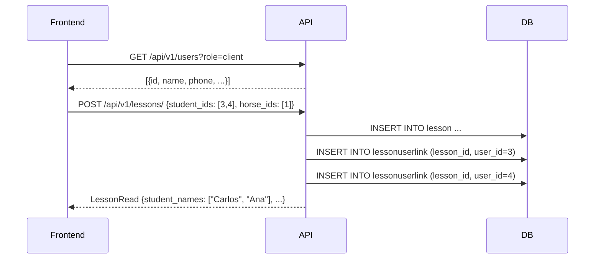

# Feature: Unificacion Client → User

## Descripcion

Refactor estructural que elimina la entidad separada `Client` (tabla de alumnos) y unifica toda la gestión de personas bajo la entidad `User`, diferenciando los alumnos mediante el rol `"client"`.

## Motivacion

El sistema tenia dos tablas para representar personas físicas relacionadas con la hípica:

- `user`: usuarios con acceso a la aplicación (admin, monitores)
- `client`: alumnos de la hípica, sin acceso a la app

Esta separación generaba duplicidad de lógica (dos CRUD independientes, dos conjuntos de endpoints, dos vistas en el frontend) y dificultaba la gestión cuando un alumno necesitaba también acceso a la app. La unificación elimina esta dualidad: **todo el mundo es un `User`**, y el rol determina su nivel de acceso.

## Solucion

Los alumnos se representan como `User` con `role="client"`. La tabla `client` fue eliminada y sus registros migrados a `user` con el campo `phone` incorporado al modelo base.

## Roles del Sistema

| Rol | Descripcion |
|-----|-------------|
| `app_admin` | Administrador global. Gestiona todas las hípicas |
| `stable_admin` | Administrador de una hípica concreta |
| `monitor` | Instructor principal de clases |
| `assistant` | Ayudante de monitor (nuevo rol) |
| `client` | Alumno de la hípica |

### STAFF_ROLES

En el endpoint de lecciones se define la constante `STAFF_ROLES = ["monitor", "assistant"]`. Ambos roles tienen los mismos permisos de lectura sobre las clases (pueden listarlas y consultarlas). La creacion y modificacion de lecciones queda restringida a `stable_admin` y `app_admin`.

```python
# app/api/v1/endpoints/lesson.py
STAFF_ROLES = ["monitor", "assistant"]
```

## Tablas Eliminadas

| Tabla | Motivo |
|-------|--------|
| `client` | Absorbida por `user` con `role="client"` |
| `lessonclientlink` | Sustituida por `lessonuserlink` |

## Tablas Nuevas

| Tabla | Descripcion |
|-------|-------------|
| `lessonuserlink` | Tabla N:N entre `lesson` y `user` (sustituye a `lessonclientlink`) |
| `clientprofile` | Perfil extendido para usuarios con `role="client"` |
| `monitorprofile` | Perfil extendido para usuarios con `role="monitor"` o `"assistant"` |

## Campo `phone` en User

El campo `phone: Optional[str]` se añadio directamente al modelo `User` (antes solo existia en la tabla `client`). Esto permite almacenar el telefono de cualquier usuario, no solo de los alumnos.

## Migracion de Datos (seed.py)

Los tres clientes de prueba que existian en la antigua tabla `client` fueron migrados como usuarios con `role="client"` y `phone` incluido:

| Nombre | Email | Telefono | Rol |
|--------|-------|----------|-----|
| Carlos | carlos@gmail.com | 600111222 | client |
| Ana | ana@gmail.com | 600333444 | client |
| Lucia | lucia@gmail.com | 600555666 | client |

El script `seed.py` ya no hace referencia a ninguna tabla `client`; crea directamente objetos `User` con `role="client"` y los usa en `LessonUserLink`.

## Cambios en Lesson

| Campo anterior | Campo actual | Tipo |
|----------------|-------------|------|
| `client_ids` | `student_ids` | `List[int]` en request |
| `client_names` | `student_names` | `List[str]` en response |

El modelo `Lesson` tiene ahora una relacion ORM `students: List[User]` a traves de `LessonUserLink`, en lugar de `clients` a través de `LessonClientLink`.

## Cambios en el Frontend

- **Vista eliminada**: `Clients.vue` — la gestion de alumnos se integra en la vista de usuarios o se filtra directamente
- **Ruta eliminada**: `/clients`
- **Lessons.vue**: para obtener el listado de alumnos disponibles al crear una clase, llama a `GET /api/v1/users?role=client` en lugar de `GET /api/v1/clients/`

## Flujo Actualizado: Crear una Clase con Alumnos



## Modelo de Datos Actualizado

```
User (role=client) ──────< LessonUserLink >───── Lesson
User (role=monitor) ─────────── Lesson.instructor_id
User (role=assistant) ────────── Lesson.helper_id
User (role=client) ──── ClientProfile (1:1, opcional)
User (role=monitor/assistant) ─── MonitorProfile (1:1, opcional)
```

## Archivos Modificados

| Archivo | Cambio |
|---------|--------|
| `app/models/user.py` | Añadido `phone`, relaciones a `ClientProfile` y `MonitorProfile` |
| `app/models/lesson.py` | Relacion `students` via `LessonUserLink` (antes `clients` via `LessonClientLink`) |
| `app/models/links.py` | Eliminada `LessonClientLink`, añadida `LessonUserLink` |
| `app/schemas/lesson.py` | `client_ids` → `student_ids`, `client_names` → `student_names` |
| `app/api/v1/endpoints/lesson.py` | Usa `LessonUserLink` y `User`, define `STAFF_ROLES` |
| `app/seed.py` | Alumnos creados como `User(role="client")`, usa `LessonUserLink` |
